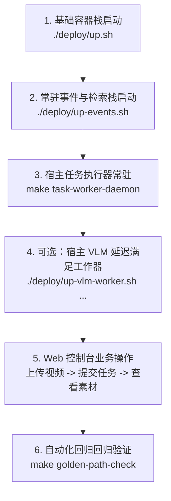

# 务必按照高性能框架底层级项目规范进行开发

# 开发期验证环境规范：底座强制容器，子节点插件允许宿主原生

根据工程规范与架构边界，开发期验证严格区分**核心底座（Base Platform / Control Plane）**与**子节点插件（Sub-node Plugins / Workers）**两层执行环境：

## 1. 核心底座开发验证：一律强制走容器

所有与核心底座相关的构建、代码检查、数据库迁移与集成验证，都必须通过 `docker compose exec -T <service> ...` 在容器内执行；宿主机不再安装、也不再直接调用底座相关的 `uv` / `python` / `node` / `npm` 工具链：
- **覆盖范围**：
  - 代码规范与静态检查：`make lint-ruff`、`make format`（Python 与 Web 前端部分）；
  - 契约与 Proto 生成：`make proto`（`tools/generate_proto.py` + `tools/generate_console_types.py`）；
  - 数据库迁移：`make migrate`（`tools/migrate.py`，依赖严格的版本校验和事务锁）；
  - 控制面服务：`api`（8091，FastAPI 业务/管理/认证）、`gateway`（8090，兼容入口）、`console`（5173，Web 控制台静态构建与反代）、`docs`（5174，开源使用文档站，纯静态 VitePress 构建与托管）；
  - 消息与索引常驻基础设施：`postgres`（25432）、`nats`（24222）、`relay`（outbox 投递）、`index`（向量检索与消费服务）、`vlm-publisher`（VLM 异步任务发布器）、`vlm-result-fuser`（VLM 异步结果融合器）；
  - 单元与集成测试：`make test-py`、`make test-integration`、`make node-check`、`make orchestration-p1-check`、`make orchestration-p2-check`、`make multimodal-pipeline-check`、`make vlm-workqueue-check`、`make event-pipeline-check`、`make plugin-deploy-check-api` 等底座编排与 API 验证。
- **目的**：确保底座运行环境纯洁、隔离、不依赖宿主机局部 Python/Node 环境，消除“在本地能跑但在生产容器无法启动”的依赖与配置漂移。
- **底座仅有的宿主例外**：
  - Rust/Cargo 工具链：现有 api / gateway / console / docs / postgres / nats 镜像均不携带 `rustc` / `cargo`，宿主机 `cargo` 暂时承担 Rust 编译与测试（`cargo check`、`cargo test`、`make orchestration-check`、`make media-check` 等）；待批准专用 Rust 工具链容器后再统一收回。
  - `make configure`：容器 bind mount 将仓库根以只读视图挂入容器，随机安全凭据写入宿主 `.env` 必须在宿主机执行。
  - 宿主平台适配器操作：macOS LaunchAgent 与 launchctl 命令（如 `resident-*` 管理、`tools/macos_resident.py`）只存在于宿主系统，必须在宿主执行。

## 2. 子节点插件与任务执行器：允许宿主原生运行

运行在各算力节点上的多模态模型处理器、Node Agent 与任务执行 Worker（如 `ocr-rapidocr`、`vlm-moondream`、`asr-whisper-mlx`、`embed-bge-onnx`、`task_executor.py`、`tools/vlm_task_worker.py` 及各类第三方算法插件），**可以不需要走容器**，直接在宿主机（Host）原生环境（Python / 虚拟环境）下运行与调试：
- **硬件加速器访问**：端侧模型强依赖宿主专属物理硬件与加速后端（例如 Apple Silicon 的 Metal / MLX / CoreML，以及特定 GPU / NPU 驱动与统一内存），开发期轻量 Linux 容器通常无法直接挂载或编译此类原生驱动（如 Apple Silicon 无法在 Linux 容器中编译 `mlx-metal`）；
- **进程与控制面隔离**：根据 ADR-001/010/012/026/030/031，节点插件设计为跨进程独立的受控 Worker，生命周期由 Node Agent / 外部进程直接拉起；插件通过标准 gRPC（`runtime.v1.ProcessorPluginService`）或跨进程共享内存租约（`LeaseBufferReader`）领料，内部不得依赖 services 内部模块，也不持有数据库凭据；
- **任务执行分工明确**：
  - `tools/task_executor.py`：消费 Node Agent 领取的 `orchestrated_v2` 执行意图，受控调用运行时与 ADR-030 热部署插件，完成全帧判别与覆盖层计算；
  - `tools/vlm_task_worker.py` / `deploy/up-vlm-worker.sh`：ADR-031 单并发 VLM 延迟满足队列工作器，执行本地按需解码与内存水位门禁；
  - `tools/task_worker.py`（`make task-worker` / `make task-worker-daemon`）：本地开发/演示环境下的宿主任务执行工作器，维持同机节点在线心跳并承接单机处理任务；
- **开发调试灵活**：插件开发者在本地开发机或局域网独立节点机（如 Mac mini、边缘设备）上进行算法调优、模型加载与推理验证（如 `make model-check`、`make asr-check`、`make ocr-check`、`make embed-check`、`make multimodal-execution-check`）时，允许直接使用宿主虚拟环境（`uv run` / 本机 Python）运行，无需强行打包进容器；
- **协同方式**：宿主原生运行的插件通过宿主机暴露的网络端口（`127.0.0.1:8091`、`24222`、`25432` 等）与容器内的底座互通；底座调度器根据节点注册的端点通过 gRPC 派发任务。

## 3. 容器服务与绑定说明

- 容器服务与绑定：
  - `api`（8091）：执行 ruff/pytest/proto/integration/plugin-artifact/smoke_gateway 类 Python 验证；PYTHONPATH 挂载 `/workspace` 及各子模块；`mlx-whisper` 以 `--no-deps` 注入，避免在 Linux 容器里编译 Apple Silicon 专属的 mlx-metal；
  - `gateway`（8090）：执行依赖 `sensoryplex_gateway` 的 smoke / 测试；
  - `console`（5173）：nginx 静态托管 + 反代 `/v1|/auth|/admin` → `api:8091`；保留 node + npm 让 `make console-build` / `make console-dev` 在容器内执行；
  - `docs`（5174）：纯静态 VitePress 文档站托管，开发预览端口 5175；
  - `postgres`（25432）/ `nats`（24222）：基础设施，容器网络内部互联；
  - `events` 常驻扩展栈（`relay` / `index` / `vlm-publisher` / `vlm-result-fuser`）：由 `up-events.sh` 统一管理，负责事件投递、向量检索及 VLM 任务队列解耦。
- 授权样本通过 `MEDIA_DIR`（默认 `~/Movies`）以只读 bind 挂到 `/host-media`，Makefile 把用户传入的 `MEDIA=...` 重写为 `/host-media/$(notdir $(MEDIA))`，容器内脚本用绝对路径读取。

---

# SensoryPlex 核心工程约定与红线

1. **规范先行**：开发前必须通读根目录需求文档、相关 ADR 设计决策及 `docs/implementation-status.md`。
2. **契约唯一源**：`proto/` 是跨进程、跨语言的唯一契约源；修改后必须运行 `make proto`，严禁手改生成代码。
3. **架构职责边界**：plugins 严禁依赖 services 内部模块。Rust 管运行时与底层媒体解码，Python 管模型适配与控制面。
4. **时间轴绝对基准与切片覆盖（ADR-028/031）**：时间轴固定为同一 stream 的 `[start_ms, end_ms)` 毫秒偏移。文件 Timeline 写侧依据可信 duration 建立完整 1 秒切片网格；模型尚未返回时仅有来源引用与待补充状态，严禁虚构 Observation 或合成空秒素材。
5. **诚实性与零静默降级**：缺失模型置信度必须显式表示未知；严禁合成业务成功数据或进行静默 fallback；降级必须有明确原因码与可观测计数。
6. **不可变事实与显式追加迁移**：数据库迁移仅允许单调递增追加，必须通过 `tools/migrate.py` 执行，禁止篡改历史 revision；发布后的 pipeline_revision 与 timeline 事实挂载拒绝修改触发器。
7. **零明文数据面与零凭据泄露**：控制消息、日志、状态行和数据库控制字段严禁包含原始帧、PCM 音频、tensor、密钥、宿主绝对路径或任意外链 URL；只传递受控引用与摘要（digest）。
8. **严格有界性与可观察性**：所有队列、并发、通道与在飞窗口必须有严格上限（档位上限）；超时、取消、重试与失败必须具备结构化错误码与可观察语义。
9. **真实证据原则**：严禁用健康检查成功、未执行或跳过的测试、合成素材宣称完整 Golden Path 已完成；所有媒体 E2E 验证必须使用真实授权样本。
10. **双语注释规范**：手写代码（Rust 的 `///`、`//!`、`//` 与 Python 的 docstring、`#`）默认中文；proto 与生成代码保持英文；专有名词（GStreamer、Opus、gRPC、protobuf、ADR 等）保留英文。
11. **编排确定性与取消优先（ADR-029）**：必需上游成功才级联解锁下游，上游失败递归阻断下游；取消优先，迟到结果安全丢弃，崩溃通过原子租约幂等恢复。
12. **热部署蓝绿隔离（ADR-030）**：热部署是独立进程的版本化蓝绿切换，不承诺进程内热重载；新版本连续就绪才切指针，失败绝不影响旧 active。
13. **慢路径异步解耦（ADR-031）**：慢路径模型（如 VLM 场景描述）必须通过 WorkQueue 延迟满足，快路径完成后立即标记 `ready_for_review`，严禁阻塞 L1 基础事实（OCR/ASR）入库与原片回看。

---

# 本地容器栈（deploy/）

容器编排文件：`deploy/compose/docker-compose.poc.yml`。
本机起停统一通过 `deploy/*.sh` 脚本；不直接 `docker compose up`，避免漏填 `--env-file .env` 或传错 `-f` 路径。所有脚本都从仓库根目录执行，并以仓库根作为 `docker compose` 的工作目录。

## 服务清单与本机端口

| 服务 | 端口（127.0.0.1） | Profile | 镜像/构建 | 用途说明 |
| :--- | :--- | :--- | :--- | :--- |
| **console** | `CONSOLE_PORT=5173` | 默认 | `apps/console/Dockerfile` | 前端 Web 容器（Nginx 静态托管 + 反代 `/v1 /auth /admin` 到 `api:8091`；保留 node/npm） |
| **docs** | `DOCS_PORT=5174`（dev 用 5175） | 默认 | `apps/docs/Dockerfile` | 开源使用文档站（纯静态 VitePress：不反代、不持凭据、无依赖，可 `./deploy/up.sh docs` 单独启动） |
| **api** | `API_PORT=8091` | 默认 | `services/api/Dockerfile` | 核心控制面（FastAPI 业务/管理/认证/调度）；dev 镜像含 ruff/pytest/proto 工具链 |
| **gateway** | `GATEWAY_PORT=8090` | 默认 | `services/gateway/Dockerfile` | 旧查询入口兼容层；执行 smoke 验证 |
| **postgres** | `POSTGRES_PORT=25432` | 默认 | `postgres:16-alpine` | 核心元数据存储；具备不可变触发器与事务 outbox |
| **nats** | `NATS_PORT=24222` | 默认 | `nats:2.11.3-alpine` | JetStream 事件总线（监控端口 `127.0.0.1:28222`） |
| **migrate** | — | 默认 | 复用 gateway 镜像 | 一次性执行 `tools/migrate.py`，完成后退出 |
| **relay** | — | `events` | 复用 api 镜像 | 事务性 outbox → JetStream 事件中继 |
| **index** | compose 内 `index:50077` | `events` | 复用 api 镜像 | 常驻消费循环 + 向量化 + Milvus Lite 向量检索服务（仅内部网络监听） |
| **vlm-publisher** | — | `events` | 复用 api 镜像 | ADR-031 VLM 异步任务发布器（PostgreSQL `vlm_task_outbox` → `sensoryplex.tasks.vlm.v1`） |
| **vlm-result-fuser**| — | `events` | 复用 api 镜像 | ADR-031 VLM 异步结果融合器（`sensoryplex.results.vlm.v1` → 事务追加 Observation/Material） |

端口值由根目录 `.env` 控制；不存在时使用默认值。

## Bind Mount 挂载规范

| 源路径 (Host) | 目标路径 (Container) | 适用服务 | 详细说明 |
| :--- | :--- | :--- | :--- |
| `${REPO_ROOT}` | `/workspace` | api, gateway, console, docs, relay, index, vlm-* | 把仓库根目录 bind 进容器，让开发与测试在容器内看到本机源码及产物。 |
| `${MEDIA_DIR:-/tmp}` | `/host-media` | api | 把授权样本目录以只读方式挂入容器；Makefile 自动重写路径供测试脚本读取。 |

`REPO_ROOT` 默认 `../../`（对应仓库根）；`.env` 已写入主机绝对路径。`MEDIA_DIR` 默认 `/tmp`，可指向 `~/Movies` 或授权测试样本目录。

## 部署脚本清单

所有脚本必须在仓库根目录下调用：

### 基础底座管理
- `./deploy/up.sh [服务名...]`：构建并启动基础容器栈（默认包含 console / docs / api / gateway / postgres / nats / migrate）；等待健康检查通过后输出访问入口。
- `./deploy/down.sh [--volumes]`：停止并移除容器和网络；传 `--volumes` 时清除数据卷。
- `./deploy/status.sh`：查看容器状态，并独立探测 console / docs / api / gateway 的 HTTP 端点。
- `./deploy/logs.sh [服务名]`：跟踪指定服务或全部服务的运行日志。

### 事件链路与异步慢路径（ADR-024 / 025 / 027 / 031）
- `./deploy/up-events.sh`：前置校验 BGE 权重（`.data/models/bge-small-zh-v1.5/onnx/model_quantized.onnx`）与 `.env`，拉起 `events` profile 下的 4 个常驻服务：`relay`、`index`、`vlm-publisher`、`vlm-result-fuser`。
- `./deploy/down-events.sh [--volumes]`：仅停止并移除 `events` profile 服务，不影响基础 api 与 postgres；传 `--volumes` 清理 `.data/index` 向量库。
- 等效 Make 目标：`make events-up`、`make events-down`、`make events-logs`。

### 宿主原生常驻工作器
- `./deploy/up-vlm-worker.sh <release_dir> <config.json>`：在 macOS 宿主安装并启动 LaunchAgent 常驻单并发 VLM 延迟满足队列工作器，结果日志输出到 `.data/vlm-worker/worker.log`。

### 演示账号体系
- `make demo-seed`：在 `api` 容器内创建演示账号 `demo`，随机密码保存至 `.data/demo-password` 并自动注入宿主 `.env`，重启 `api` 加载；登录页底部自动出现「填入演示账号」按钮。
- `make demo-reset`：重置演示账号密码，不重新生成账号结构。

---

# Makefile 开发验证全景表

`make` 目标执行位置严格遵循**底座强制容器，子节点插件与硬件绑定链路走宿主**的原则：

| 分类 | 目标 (Target) | 执行位置 | 核心说明 |
| :--- | :--- | :--- | :--- |
| **基础与环境** | `make configure` | **host** | 生成随机凭据并写入宿主 `.env`（容器只读挂载不可写） |
| | `make setup` | host + api 容器 | 依序执行 configure、容器内 proto 生成与主机 cargo build |
| | `make proto` | api 容器 | 重新生成 Python/TypeScript protobuf 与契约代码 |
| | `make lint-ruff` | api 容器 | 执行 Python ruff 语法检查与格式校验 |
| | `make format` | host + api 容器 | 宿主 cargo fmt 格式化 Rust；容器内 ruff 格式化 Python |
| | `make test-contracts`| api 容器 | 运行轻量契约单元测试（pytest tests/contracts） |
| | `make test-integration`| api 容器 | 依赖真实 PostgreSQL 与 NATS 的集成测试（pytest tests/integration） |
| | `make test-py` / `test`| api 容器 | 运行所有 Python 测试（契约 + 集成） |
| | `make check` | host + api 容器 | 全面准入检查：ruff + pytest + cargo fmt/clippy/test |
| **容器基础设施** | `make up` / `down` / `infra` | host shell | 启动、停止或仅拉起底层基础设施（postgres, nats） |
| | `make migrate` | migrate 容器 | 执行不可变追加式数据库迁移（`tools/migrate.py`） |
| | `make events-up` / `down` / `logs` | host shell | 管理常驻事件与慢路径栈（relay, index, vlm-publisher, vlm-result-fuser） |
| | `make stream-up` / `down` / `status` | host shell | 管理独立 MediaMTX 流媒体测试服务（RTMP/SRT） |
| **Web 控制台与文档**| `make console-build` | console 容器 | 容器内执行 `npm ci && npm run build` 并刷新 Nginx 静态目录 |
| | `make console-dev` | console 容器 | 容器内启动 Vite 开发服务器（0.0.0.0:5173） |
| | `make console-check` | api 容器 | 驱动 `tools/verify_console.py` 进行控制台端点与素材验证 |
| | `make docs-install` | docs 容器 | 安装文档站 VitePress 依赖（唯一允许的联网操作） |
| | `make docs-build` | docs 容器 | 构建纯静态文档产物（支持 `DOCS_BASE` 与 `DOCS_SITE_URL`） |
| | `make docs-check` | docs 容器 | 静态检查：验证多语言路由对等性与所有站内死链 |
| | `make docs-dev` / `serve` | docs 容器 | 启动文档开发热更新服务或产物预览（5175 端口） |
| **执行编排核心 (ADR-029)**| `make node-check` | api 容器 | 验证局域网节点注册、心跳、5项预检与拓扑隔离（ADR-026） |
| | `make orchestration-check` | **host** | Rust 运行时编排 DAG 校验与静态检查 |
| | `make orchestration-p1-check` | api 容器 | ADR-029 P1：单机真实编排闭环（DAG状态机、幂等、级联解锁、取消阻断、有界重试、崩溃恢复） |
| | `make orchestration-p2-check` | api 容器 | ADR-029 P2：受控多节点集群编排与可审计故障转移（Failover）验收 |
| | `make multimodal-pipeline-check` | api 容器 | ADR-028/029/030：多模态方案 v2 控制面契约与 DAG 发布准入校验 |
| | `make multimodal-execution-check`| **host** | 调度真实本机三模态插件执行多模态闭环并输出覆盖层报告 |
| **插件热部署 (ADR-030)**| `make plugin-release` | **host** | 构建受控平台定向 bundle 并复算整包与文件摘要至 `.data/releases/` |
| | `make plugin-release-verify` | **host** | 校验指定 bundle 压缩包的摘要与完整性 |
| | `make plugin-deploy-check-api` | api 容器 | 控制面契约验收：release 导入、状态机、蓝绿切换、排空、回滚、准入 |
| | `make plugin-deploy-check-native`| **host** | 原生执行器验收：真实 LaunchAgent、进程隔离、endpoint 读取与双槽位切换 |
| | `make plugin-deploy-check` | host + api 容器 | 完整热部署验收：串联 API 控制面与原生执行器 |
| **事件中继与向量检索**| `make outbox-check` | api 容器 | ADR-024：验证 PostgreSQL outbox 事务发布至 NATS JetStream 这一跳 |
| | `make vlm-workqueue-check` | api 容器 | ADR-031：验证 JetStream WorkQueue 并发拉取、AckWait 重投与消息边界 |
| | `make consume-check` | **host** | ADR-025：验证单进程常驻消费、BGE 向量编码与 Milvus Lite 写入 |
| | `make event-pipeline-check` | api 容器 | ADR-027：验证容器常驻 relay/index 与 API 语义检索端到端闭环 |
| | `make index-check` | **host** | ADR-020：真实 BGE 向量落库与 Milvus Lite 跨进程读写确认 |
| | `make semantic-check` | **host** | ADR-023：常驻检索面（serve）与网关语义检索（`mode=semantic`）接口验收 |
| **媒体与模型底层 (M8~M10)**| `make media-check` / `media-test` | **host** | GStreamer 媒体解码核心与单元测试 |
| | `make media-replay` | host + api 容器 | 真实授权视频解码、自适应抽帧与 LeaseBuffer 写入验证 |
| | `make handoff-check` | host + api 容器 | 验证跨进程数据面交接与内存租约释放 |
| | `make live-check` | host + api 容器 | SRT 实时流接入、断流重连与交接验证（需 MediaMTX） |
| | `make backpressure-check` | host + api 容器 | 验证解码与消费有界队列的背压降级与可观测性 |
| | `make capability-check` | host + api 容器 | ADR-009：19 种媒体格式准入与显式拒绝错误码验证 |
| | `make accelerator-check`| **host** | ADR-022：宿主硬件加速器（Metal/CoreML/CUDA）探测对账 |
| | `make ocr-check` | host + api 容器 | ADR-016：RapidOCR 插件端侧推理与文本像素定位验证 |
| | `make asr-check` | host + api 容器 | ADR-014：MLX-Whisper 插件音频转写与时间戳对齐验证 |
| | `make embed-check` | **host** | ADR-017：BGE ONNX 文本嵌入与 L2 归一化向量生成 |
| | `make model-check` | host + api 容器 | ADR-012：Moondream VLM 插件推理与 observation 输出验证 |
| | `make timeline-check` | **host** | ADR-028：Runtime → Timeline → 事务入库 → JetStream 端到端 |
| | `make timeline-resident-check` | **host** | ADR-028：真实媒体 Timeline 素材经常驻 relay/index 语义检索 |
| **业务闭环与宿主 Worker** | `make task-worker` | **host** | 前台运行宿主任务工作器（处理控制台任务 + 节点心跳） |
| | `make task-worker-daemon` | **host** | 后台常驻守护运行宿主任务工作器（double-fork，抗 SIGHUP） |
| | `make task-worker-status` / `stop` | **host** | 查看状态或安全停止后台任务工作器 |
| | `make prune-plugins` | **host** | 物理清理各节点历史淘汰插件版本、非活跃 runtimes 与孤立 units |
| | `make prune-mcp` | **host** | 一键安全清理当前项目或全局的 SensoryPlex MCP 与 AI 技能配置 |
| | `make golden-path-check` | host + api 容器 | **GP-01 全链路业务回归验收**：视频准入 -> 任务执行 -> 融合入库 -> 向量索引 -> 语义检索 -> Range 回看 |

---

# 核心架构机制与规范深度解析

## 1. 可编排插件执行核心（ADR-029，P0 / P1 / P2）

将多模态处理解耦为声明式、不可变的 DAG 流水线执行体系：
- **不可变 Revision 与持久状态机**：
  - `pipeline_revision` 发布后挂载 `deny_fact_update` 数据库触发器，禁止原地修改或删除；
  - `pipeline_run` 基于 `(pipeline_id, revision, input_ref, idempotency_key)` 建立严格的部分唯一索引，保障并发调用下的完全幂等性；
  - 任务状态机：`pending → ready → assigned → running → succeeded / failed / blocked`。
- **严格调度硬约束与多节点感知（P2）**：
  - **数据本地性硬拦截**：同机节点（`is_co_located=True`）独占消费原始 `BufferDescriptor`（共享内存）；远程节点仅处理 Observation 或对象引用；跨机 Raw Buffer 边在解析期和调度期均双重硬拦截（拒绝码 `data_locality_violation`）；
  - **级联解锁与阻断**：必需上游成功后递归级联解锁下游任务；必需上游失败时下游递归标记 `blocked`（原因码 `upstream_failed`）；
  - **取消优先原则**：Run 取消后立即级联取消所有未完成任务，迟到结果安全丢弃，绝不反向改写为成功；
  - **可审计故障转移（Failover）**：当节点失联或租约超时，恢复器原子回收任务并重新派发至备用节点，保留完整的 assignment 审计历史；节点处于 draining 或 offline 状态时调度器直接 409 拒绝。

## 2. 插件热部署与版本化蓝绿切换（ADR-030，local_native）

实现首方、自研 Python 原生插件在不中断底座服务情况下的独立进程热部署：
- **安全与离线边界**：
  - 制品身份由 `artifact_digest`（可执行代码签名）与 `bundle_digest`（整包传输内容摘要）双重锁死；
  - Agent 从认证端点下载 bundle，解包前必须严格校验路径穿越、符号链接、超限成员与哈希值；
  - 安装依赖完全使用 bundle 内的 `wheelhouse` 离线安装，部署期严禁联网；
- **双槽位与状态流转**：
  - 逻辑槽位包含 `active` 实例与 `candidate` 候选实例；
  - 状态机：`accepted → staging → starting → validating → candidate_ready → cutting_over → draining_old → succeeded`；
  - 准入与切换门禁：候选进程以 `--port 0` 启动，端口从原子落盘的 loopback endpoint 文件读取；候选实例必须依次通过 `Describe` → 摘要核对 → `ValidateConfig` → `Start` → 连续 3 次 `Health=ready` 才允许原子切换指针；
  - 切换前任何失败保持原 active 不动；显式回滚通过创建反向部署操作实现，不篡改历史。

## 3. VLM 延迟满足 WorkQueue（ADR-031）

解决计算密集型 VLM（如 Moondream 场景描述）阻塞快路径的问题：
- **快慢路径架构解耦**：
  - OCR 与 ASR 属于用户需即时交互与检索的 L1 基础事实，走 Timeline 同步快路径；
  - 快路径入库后，执行状态立即流转为 `ready_for_review`：用户可直接在 Web 控制台检索文字定位、浏览秒级切片与播放原片；
  - VLM 移出同步 DAG，转化为延迟补全任务（`delayed_enrichments`）；
- **JetStream WorkQueue 消息通道**：
  - 任务流 `sensoryplex-tasks`（WorkQueue 模式，File 存储，有界容量）；
  - 任务主题：`sensoryplex.tasks.vlm.v1`，结果主题：`sensoryplex.results.vlm.v1`；
  - 消息只携带受控 `TaskInputManifest`（`asset_id`、时间锚点 `[start_ms, end_ms)`、Prompt、插件版本及摘要），严禁携带 Raw Buffer、宿主文件路径或外链 URL；
- **宿主 Consumer 本地解码与内存门禁**：
  - 宿主插件 Consumer（`tools/vlm_task_worker.py`）单并发 `fetch(batch=1)` 竞争拉取；
  - 显式内存水位门禁：fetch 前探查系统可用内存（macOS 包含 free+inactive+speculative），不足阈值（`min_free_memory_bytes`，最低 256 MiB）时挂起等待，严禁 OOM；
  - 收到任务后在宿主机只读媒体根中按 content hash 读取原片，使用 FFmpeg 仅解码锚点对应单帧图像传给模型推理；
- **不可变对账与增量融合**：
  - 底座 `vlm-result-fuser` 接收结果后，先将回传 manifest 与 outbox 中的原始不可变 bytes 逐字比对，校验时间范围与 Observation 血缘；
  - 校验通过后，事务性追加 Observation/Material、更新时间轴状态并发布 material 事件，触发常驻 index 增量生成 BGE 向量；
  - 最终收敛执行状态为 `succeeded` 或 `succeeded_with_partial_enrichment`。

## 4. 时间轴事实契约与全覆盖切片网格（ADR-028 / 031）

- **1 秒网格连续切片**：Timeline 写侧依据文件的真实 probe duration 建立 `[0, duration)` 的完整 1 秒来源切片网格（尾部不足 1 秒保留，单媒体上限 7200 片）；
- **严禁虚构 Observation**：某 1 秒内若模型尚未返回或未检测到内容，该切片仅保存来源引用与待补充/无文字状态，绝不合成空 Observation 或虚构识别成功；
- **分批展示与可观测性**：Web 控制台详情按 100 片分页展现，每 10 秒滚动刷新，确保超长视频下前端性能平稳。

---

# 全链路闭环与日常维护实操手册

当需要验证从「Web 控制台上传视频」到「提取多模态观测」及「最终向量语义检索」的端到端完整闭环时，请严格按以下步骤操作：



### 第一步：启动容器底座与常驻事件检索栈
```bash
# 启动核心容器：console(5173), api(8091), postgres(25432), nats(24222)
./deploy/up.sh

# 启动 ADR-027 / 031 常驻服务：relay, index(50077), vlm-publisher, vlm-result-fuser
./deploy/up-events.sh

# 检查各端点健康状态
./deploy/status.sh
```

### 第二步：启动宿主机任务执行工作器（常驻守护）
```bash
# 启动后台守护进程（维持 local-host 节点在线心跳，调度 GStreamer + OCR + Timeline 融合）
make task-worker-daemon

# 查看工作器运行日志与在线状态
make task-worker-status
# 停止命令：make task-worker-stop
```

### 第三步：可选启动宿主 VLM 延迟满足队列工作器（ADR-031）
若任务方案包含 VLM 场景描述补全，启动单并发队列工作器：
```bash
./deploy/up-vlm-worker.sh .data/releases/vlm-moondream/0.1.3/darwin-arm64 config/plugins/vlm-local-decode.json
# 查看日志：tail -f .data/vlm-worker/worker.log
```

### 第四步：Web 控制台全流程业务操作
1. **登录控制台**：打开浏览器访问 `http://127.0.0.1:5173`，点击登录框底部的「填入演示账号」（若首次使用先执行 `make demo-seed`）；
2. **导入视频**：进入【视频库】（`/assets`），点击「导入视频」上传本地 `.mp4` 或 `.webm` 视频，上传完毕后完成媒体准入；
3. **分发任务**：进入【处理任务】（`/jobs`），新建任务并关联已上传视频与多模态处理方案（如内置 OCR+Timeline 方案），点击「开始处理」；
4. **即时查看素材（快路径）**：宿主工作器处理完毕后，状态流转为 `ready_for_review`，点击「查看素材」进入【素材检索】（`/materials`）：
   - 按秒级网格连续切片浏览多模态观测事实；
   - 查看高亮提取的文字块并进行帧像素定位；
   - 原片 Range 流式切片回放与锚点定位；
5. **语义检索（向量索引面）**：在搜索栏输入文本内容，选择「语义检索」模式，底座通过常驻 `index` 服务完成 Milvus 向量相似度检索并即时命中素材。

### 第五步：全链路自动化回归验收
在开发改动后，执行全链路端到端自动化验收脚本：
```bash
make golden-path-check
```
该命令在真实环境下串联验证：鉴权认证、节点心跳、视频上传准入、方案发布、任务分发、端侧算力推理、Timeline 融合入库、Milvus 向量索引、语义检索与原片 Range 流式回放全部 9 大业务场景。
