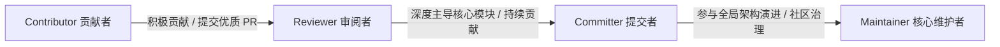

# SensoryPlex 贡献指南与开源社区公约 (Contributing Guide)

欢迎来到 **SensoryPlex** 开源项目！

SensoryPlex 致力于打造业内领先的**端侧 AI 多模态素材预处理基座**，融合了底层高性能媒体处理（Rust / GStreamer）、端侧异构硬件推理（Apple Silicon Metal/MLX、NVIDIA CUDA、CoreML、ONNX）、流式事件与向量检索（PostgreSQL Outbox、NATS JetStream、Milvus Lite）以及现代 Web 控制面。

我们深信，一个强大、稳定、高可用且面向多元化端侧生态的底层基础设施，离不开全球优秀开源社区成员的共同建设。我们热切期盼并诚挚邀请在多媒体流处理、端侧模型优化、分布式系统、系统级 Rust/Python 以及前端工程领域的开发者加入我们，共同推进项目的更新、演进与长期维护！

---

## 目录

1. [社区治理与成长梯队 (Community Governance)](#一社区治理与成长梯队)
2. [核心工程约定与红线 (Non-negotiable Rules)](#二核心工程约定与红线必须严格遵守)
3. [开发与验证环境规范 (Execution Environment)](#三开发与验证环境规范底座容器与宿主原生)
4. [重点招募与贡献方向 (Call for Contributions)](#四重点招募与贡献方向)
5. [提交流程与规范 (Contribution Workflow)](#五提交流程与规范)
6. [RFC 机制与重大变更 (RFC Process)](#六rfc-机制重大设计演进)
7. [社区交流与联系方式](#七社区交流与支持)

---

## 一、社区治理与成长梯队

SensoryPlex 倡导**开放、透明、精英共治与证据导向**的社区文化。我们建立了清晰的贡献者成长路径，优秀成员将逐步获得仓库权限，共同主导项目演进：



### 1. Contributor (贡献者)
- **资格**：任何为 SensoryPlex 提交过 Issue、文档修订、Bug 修复、新测试用例或功能 PR 并被合并的开发者。
- **权益**：列入项目 Contributors 致谢名单，受邀进入社区专属开发者讨论群组。

### 2. Reviewer / Triager (审阅与分类者)
- **资格**：在社区活跃度高，提交过多个高质量 PR，并积极对他人 PR 提供客观、高质量、符合工程红线的审查意见。
- **职责**：协助维护团队审阅社区 Pull Request、分类并协助复现 GitHub Issues，引导新贡献者符合项目工程规范。

### 3. Committer (代码提交者)
- **资格**：在媒体底层（Crates）、控制面（API/Console）、端侧模型插件或事件流栈中至少一个核心领域有持续深度贡献，深度认同 ADR 架构体系与工程红线。由至少两位 Maintainer 提名并通过。
- **权益与职责**：获得仓库的 Write/Triage 权限，主导所负责模块的代码合并与技术审查，指导初级贡献者。

### 4. Maintainer / PMC (核心维护者)
- **资格**：对 SensoryPlex 具有全面的全局架构把控力，长期主导项目路线图规划、版本发布与安全响应。
- **职责**：对重构提案、架构决策（ADR/RFC）、代码仓库核心分支写权限与版本发版拥有最终裁决权；维护开源社区健康发展与守则执行。

---

## 二、核心工程约定与红线（必须严格遵守）

SensoryPlex 是一个高性能、底层级的生产就绪基础设施。为了保障系统的确定性、可溯源性与长期演进质量，**以下 13 条核心工程红线不可妥协，所有 PR 在合并前均会以此进行严格审查**：

1. **规范与设计先行**：阅读本次变更涉及的需求、ADR 及 `docs/implementation-status.md` 相关章节；涉及跨模块架构、契约或业务验收时补读依赖章节。纯文案、样式与只读审查按任务需要读取。改动如涉及核心逻辑变更，必须附带 ADR 修订或 RFC 提案。
2. **契约唯一源（Proto/gRPC）**：`proto/` 是跨进程、跨语言交互的唯一权威契约源。修改契约必须运行 `make proto` 并提交重新生成的代码；**严禁手工修改任何生成代码**。字段号分配永久有效，废弃字段显式标记 `reserved`。
3. **架构职责与分层隔离**：`plugins` 严禁依赖 `services` 内部模块；Rust 负责高吞吐底层媒体解码与共享内存控制，Python 负责端侧模型适配、控制面调度与业务编排。
4. **时间轴绝对基准与切片覆盖（ADR-028/031）**：所有时间轴锚点严格对齐为同一媒体流的 `[start_ms, end_ms)` 毫秒偏移。写侧依据真实媒体时长建立不可变 1 秒切片网格；模型未返回或无内容时只记录来源引用与待补充/无文字状态，**严禁虚构 Observation 或合成空秒素材**。
5. **诚实性与零静默降级**：模型置信度缺失、PTS 未知、探测不出的加速器均必须显式标记为未知并记录原因；**严禁合成业务数据、伪造虚假测试通过或进行静默 fallback**；降级必须具备结构化错误码与可观测指标。
6. **不可变事实与显式追加迁移**：元数据事实一旦入库绝不原地改写（数据库具备不可变触发器保护）；数据库 Schema 变动**仅允许单调递增追加**迁移文件并通过 `tools/migrate.py` 执行，**严禁篡改历史迁移文件**。
7. **零明文数据面与零凭据泄露**：控制消息（HTTP/gRPC）、NATS 事件、系统日志与数据库字段中，**严禁传输原始帧、PCM 音频、Tensor 矩阵、密钥或宿主私有文件绝对路径**；仅传递受控引用（`asset_id`）、租约凭据与内容哈希摘要（Digest）。
8. **严格有界性与可观测性**：所有队列容量、并发上限、在飞窗口与重试次数必须受显式机型档位上限约束；任何超时、取消或失败必须有明确的结构化错误码，严禁无上限缓冲。
9. **真实证据原则**：**严禁用健康检查成功（healthy）、被跳过的测试或合成数据宣称链路完成**；媒体端到端验证必须使用真实的授权样本或公开许可样本（`tests/fixtures/media/OPEN-SAMPLES.md`）。
10. **双语注释规范**：手写代码注释（Rust 的 `///`、`//!`、`//` 与 Python 的 docstring、`#`）默认使用中文；`proto/` 契约文件与生成代码保持全英文；专有名词（GStreamer、Opus、gRPC、NATS、ADR 等）保留英文原名。
11. **编排确定性与取消优先（ADR-029）**：必需上游成功才级联解锁下游，上游失败递归阻断下游；取消优先，迟到结果安全丢弃，崩溃通过原子租约幂等恢复。
12. **热部署蓝绿隔离（ADR-030）**：原生插件热部署采用版本化双槽位进程隔离；新版本连续 3 次通过就绪探测才原子切换指针，失败绝不影响原 active 实例，依赖安装 100% 离线闭环。
13. **慢路径异步解耦（ADR-031）**：耗时长的计算密集型模型（如 VLM）走 NATS WorkQueue 异步延迟满足；快路径（OCR/ASR）完成后任务立即流转为 `ready_for_review`，绝不阻塞用户首屏交互与原片回看。

---

## 三、开发与验证环境规范（底座容器与宿主原生）

为彻底消除“本地能跑但生产容器报错”的环境漂移，同时兼顾端侧物理硬件加速性能，SensoryPlex 实行严格的分层执行规范：

| 层次 | 覆盖模块 | 执行位置 | 核心原因与规则 |
| :--- | :--- | :--- | :--- |
| **核心底座 / 控制面** | `api`, `gateway`, `console`, `postgres`, `nats`, `relay`, `index`, `vlm-*` | **强制在容器内执行**<br/>`docker compose exec -T ...` | 确保运行环境隔离纯洁；宿主机无需配置也严禁直接调用底座相关的 uv/python/node/npm 工具链。 |
| **子节点插件 / Workers** | 各类端侧模型插件（`ocr-rapidocr`, `asr-whisper-mlx`, `vlm-moondream`）、`tools/task_worker.py` | **允许宿主原生运行**<br/>(Host Native) | 强依赖宿主机专属物理硬件加速（Apple Silicon Metal/MLX、CoreML、CUDA、NPU），轻量 Linux 容器无法透传编译原生驱动。 |
| **Rust 底座构建与验证** | `cargo` 构建、fmt、clippy、单元测试 | **默认在 rust 容器执行** | `CARGO_CMD` 按 `EXEC_MODE` 选择执行环境；无 Docker 的既定宿主模式及宿主原生执行器所需构建按 `AGENTS.md` 的边界执行。 |
| **宿主系统例外** | 随机凭据生成 (`make configure`)、macOS LaunchAgent (`tools/macos_resident.py`) | **宿主原生运行** | macOS 守护调度与宿主环境变量必须直接作用于宿主。 |

### 常用本地开发验证命令

```bash
# 1. 基础环境搭建与初始化配置
make configure          # 生成安全随机凭据至 .env（宿主执行）
./deploy/up.sh          # 构建并拉起核心容器栈（console, api, postgres, nats 等）
./deploy/up-events.sh   # 拉起常驻事件中继与向量检索栈 (relay, index, vlm-publisher)

# 2. 按变更范围选择检查；合并与发布门禁仍须满足既定要求
make lint-ruff          # Python 语法与格式检查（容器内执行）
make format             # 格式化 Rust (rust 容器) 与 Python (api 容器)
make proto              # Proto 契约变更后生成对应代码（api 容器，必须提交生成产物）
make test-contracts     # 单元契约测试（容器内）
make test-integration   # 真实数据库与消息队列集成测试（容器内）
make check              # 全面准入检查 (lint + pytest + cargo test)

# 3. 核心流水线与端到端验证
make orchestration-p1-check   # 真实单机 DAG 编排闭环（状态机、级联解锁、故障恢复）
make event-pipeline-check     # 容器常驻 relay/index 与 API 语义检索闭环
make multimodal-execution-check # 调度真实本机三模态插件执行多模态闭环
```

---

## 四、重点招募与贡献方向

SensoryPlex 诚邀社区伙伴在以下方向共同发力（您可以直接认领或提出新的技术方案）：

1. **多样化硬件与 NPU 加速扩展**：
   - 适配 NVIDIA Jetson 边缘计算平台（TensorRT / DeepStream 加速）；
   - 适配国产化边缘硬件（如华为昇腾 Ascend NPU / CANN、瑞芯微 RK3588 NPU / RKNN）；
   - Intel OpenVINO / CoreML 深度优化。
2. **多模态模型生态扩充**：
   - 接入更多轻量级 SOTA 端侧视觉语言模型（InternVL2、Qwen2-VL 等）；
   - 新增专用感知模态插件（声音事件检测 SED、人脸与敏感特征匿名化脱敏等）。
3. **媒体流式协议与编解码增强**：
   - 扩展 WebRTC / RTSP 实时低延迟推拉流接入通道；
   - AV1 / H.265 硬件解码加速与自适应动态抽帧策略优化。
4. **分布式拓扑与生产级安全加固**：
   - 完善跨机节点间 mTLS 双向认证证书自动签发与轮换机制；
   - 控制面（API / PostgreSQL / NATS）高可用（HA）多节点集群方案。
5. **Web 控制台与交互体验**：
   - 优化大规模时序切片可视化渲染性能（虚拟滚动、Canvas 视轨）；
   - 强化多模态素材的富媒体标注与人机交互纠错流。

---

## 五、提交流程与规范

### 1. 开发流程
1. **Fork 仓库** 到您的个人 GitHub 账号下；
2. **基于最新 `master` 创建特性分支**，命名遵循规范（例如 `feat/rockchip-rknn-plugin` 或 `fix/timeline-boundary-overflow`）；
3. **本地开发与自测**：严格遵循分层执行规范，运行对应的 `make` 检查确保全部 Pass；
4. **提交 Commit**：遵循 [Conventional Commits](https://www.conventionalcommits.org/) 规范：
   - `feat(...)`: 新功能或新插件
   - `fix(...)`: 缺陷修复
   - `docs(...)`: 文档修订或翻译
   - `refactor(...)`: 架构重构（不改变外部行为）
   - `test(...)`: 增加或优化测试用例
   - `perf(...)`: 性能优化
5. **推送分支并创建 Pull Request**：详细填写 PR 模板中的各项自检清单与验证证据。

### 2. PR 审查与合并准则
- 必须通过本地所有强制静态检查与契约测试；
- 严禁出现与 13 条核心工程红线相冲突的改动；
- 至少获得一位 Committer 或 Maintainer 的 LGTM 审批；
- 所有对话讨论均已得到解决（Resolved）；
- 代码合并采用 `Squash and merge` 或 `Rebase and merge`，保持主干历史清晰整洁。

---

## 六、RFC 机制（重大设计演进）

针对以下重大变更，我们鼓励在编码之前先提出 **RFC（Request for Comments）** 提案以凝聚社区共识：
- 跨语言 Proto 核心契约或字段含义的破坏性升级；
- 引入新的重度第三方框架或底层架构中间件；
- 新增一等支持的部署拓扑或网络通信模型；
- 新的数据持久化模型或重大存储表结构重构。

**RFC 流程**：
1. 复制 `.github/ISSUE_TEMPLATE/rfc_template.md` 模板；
2. 在 GitHub Issues 中以 `[RFC] <提案标题>` 发起讨论；
3. 社区成员与 Maintainers 将在 Issue 和 GitHub Discussions 中针对设计动机、替代方案、性能开销与升级兼容性进行充分论证；
4. 获得批准后转入 ADR 正式文档归档并开始实施。

---

## 七、社区交流与支持

- **GitHub Discussions**：讨论新想法、技术答疑与社区头脑风暴；
- **GitHub Issues**：报告 Bug、跟踪功能请求与 RFC 提案；
- **核心维护者联系邮箱**：`50646043@qq.com`（商务合作、安全报告与核心社区治理）；
- **微信开发者交流群**：欢迎扫描下方作者个人微信二维码（添加请备注「SensoryPlex」），加入开发者群交流：

<div align="center">
  
  <p><sub>扫码添加微信（备注：SensoryPlex）</sub></p>
</div>

再次感谢您对 SensoryPlex 的关注与支持！让我们携手打造最极致、最可靠的端侧多模态基础设施！
