# SensoryPlex

<p align="center">
  <a href="LICENSE"></a>
  <a href="https://zhipentu.github.io/SensoryPlex/"></a>
  <a href="CONTRIBUTING.md"></a>
  <a href="CODE_OF_CONDUCT.md"></a>
  <a href="https://github.com/ZhiPenTu/SensoryPlex/issues"></a>
</p>

端侧 AI 多模态素材预处理框架。按现有 ADR 建立 **Rust Core + Python AI SDK +
Protobuf/gRPC + FastAPI** 工程，为 SRT/文件接入、感知、时间轴融合和可溯源检索提供基础。

产品当前以 **Web Console** 交付，不做 Electron/Tauri 等桌面客户端。部署目标是一个可跨受支持平台运行的
主节点（控制面）和可选的插件子节点：子节点可与主节点同机，也可安装到局域网内的 Mac mini、NVIDIA 或
厂商 NPU 主机，由主节点按节点能力、资源和数据本地性调度。ADR-026 的节点 Agent、注册/心跳、预检、
插件部署意图/回滚和审计已完成并经 `make node-check` 验收；生产级跨机 mTLS 轮换与主节点高可用仍未完成。
详见 [ADR-026](docs/adr/ADR-026-Web主节点与局域网插件worker拓扑.md)、
[开发执行清单](docs/development-checklist.md) 与 [实现状态](docs/implementation-status.md)。

“跨平台”只承诺受支持组合：控制面为 `linux-x86_64` / `linux-aarch64` 容器，以及
`macos-aarch64` 主机上的无加速容器组件；模型 worker 按硬件原生或容器运行。Windows 当前仅可通过
WSL2/Docker 兼容运行，不是已验收的一等部署目标。共享内存、DMA、CUDA/Metal 句柄严格 host-local，
不会因局域网拓扑而经 NATS 传输原始媒体。

当前版本 **0.1.0：可运行工程底座**。已实现素材元数据事务写入、不可变 revision、
来源/模型血缘校验，以及带鉴权的关键词、标签、时间范围查询。媒体侧已接入 GStreamer 真实解码
（可选 `gstreamer` feature）：解码 → 有界 arena → `BufferDescriptor` → lease 签发/校验/释放 → 音频 5 秒切段，
并对视频做自适应抽帧（keep/skip 全部带原因），已在授权样本与 10 个公开许可样本上通过回放验收
（其中 6 个用于 ADR-009 格式准入矩阵，出处与许可见 `tests/fixtures/media/OPEN-SAMPLES.md`）。
跨进程数据面（M3）也已落地：`replay --handoff-listen` 把样本留在共享内存里，独立进程按 lease 读取、
校验摘要并显式释放，容量与 lease 生命周期都有上限（见 ADR-010；消费方目前是验收脚本，不是模型 worker）。
SRT 实时接入（M4）同样可用：`ingest` 在有限窗口内拉流、解码并测量断流与恢复，重连归解码元素
（`srtsrc auto-reconnect`），本进程只测量；直播没有已知时长，因此不产出 anchor 区间。
背压指标（M2）与四个端侧模型插件（VLM/ASR/OCR/BGE，ADR-012/016/017）已接入；BGE 向量也已能
落库并检索回来（`services/index-worker`，ADR-020，本机为 Milvus Lite 文件形态）。事务性 outbox
的事件也已能**确认发到** NATS JetStream（`services/outbox-relay`，ADR-024：`published_at` 只在确认
之后写、`Nats-Msg-Id = event_id` 由 duplicate window 吸收重发、stream 漂移只报不改）；
**NATS → sink 的消费循环**（ADR-025）与 **relay / index 进 compose + 事件链路按机型档位准入**
（ADR-027）也已接上——两个常驻进程在 `events` profile 里跑，消费深度超过本档上限即拒绝启动。
仍未接线的是 NATS 任务分发。网关侧语义检索已按 ADR-023 接上真实检索面
（`mode=semantic` 不再是 501：常驻 `sensoryplex-index serve` 持有向量库，API 只转发查询并按
`(material_unit_id, revision)` 水合事实），服务端 Milvus 拓扑在本机 Docker Hub 不可达的情况下
未经验收。相关 API 明确报告能力不可用。

## 📸 项目界面与核心功能全景 (Web Console Showcase)

SensoryPlex 交付了工业级现代前端控制台（Web Console），直观呈现从多模态模型感知、可编排流水线调度、毫秒时间轴事实融合到跨视频语义检索与原片回看的全闭环：

### 1. 登录与工业级控制台底座 (Login & Studio Base)
> 现代高质感工业设计，“让每一段画面，都有据可循”，支持开发期一键免密体验（Demo 快速登录），集成边缘节点本地认证与会话管理。

<p align="center">
  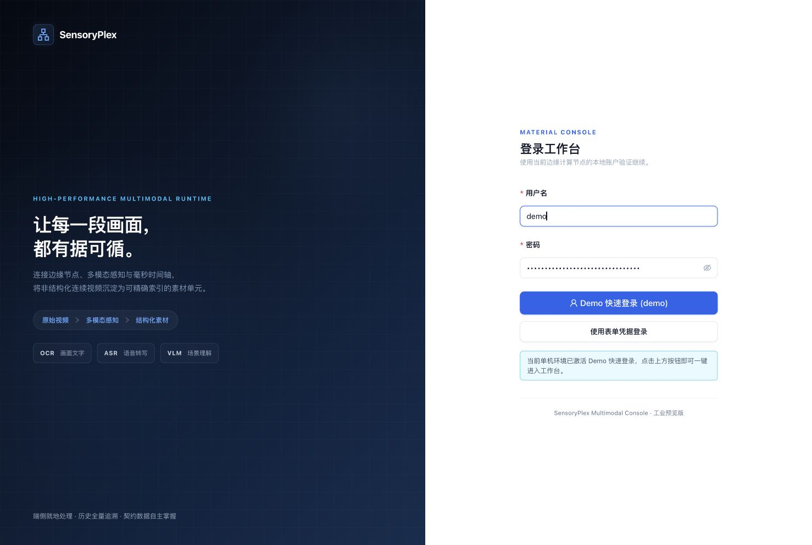
</p>

### 2. 多模态时间轴检索与 SENSORYPLEX HUD 仪表盘 (Timeline & HUD Monitor)
> **毫秒级全模态协同与流式回放**：左侧 Timecode 与覆盖范围监控，中间集成 HTTP Range 原片视频播放器（支持游标精准步进与定位同步），右侧与底部联动展示 OCR 画面文字提取、ASR 语音转写对齐以及 VLM 场景画面描述事实；最下方呈现具备毫秒精度的多轨时间轴总线（Timeline Bus）。

<p align="center">
  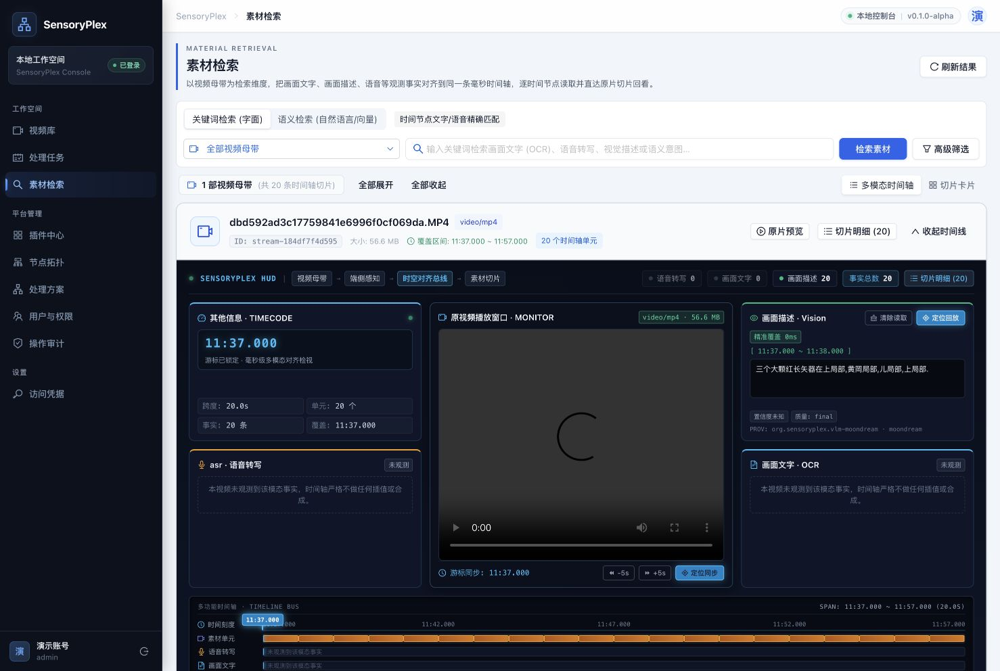
</p>

### 3. 跨视频多模态向量语义检索 (Semantic Vector Search)
> **自然语言意图搜索与秒级片段定位**：基于常驻 BGE 文本嵌入与 Milvus Lite 向量引擎，支持直接输入自然语言描述（如“红长矢器”、“中文模块”）在全量素材中秒级检索，返回向量距离与相似度排序，并支持一键定位回看指定毫秒片段的原片画面。

<p align="center">
  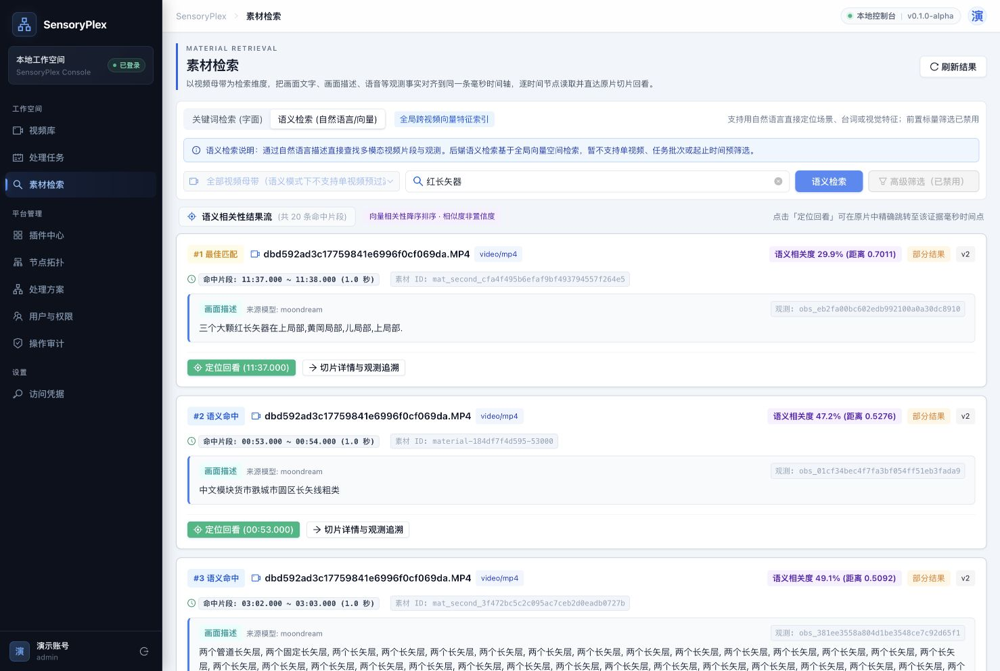
</p>

### 4. 1秒网格全覆盖连续时间轴切片 (Timeline Slices & Facts)
> **严格不可变事实追溯**：严格落实 ADR-028/031，时间轴依据原片可信时长建立全覆盖的 1 秒来源切片网格；清晰呈现每一秒内的模型版本、观测事实及回放锚点，无识别结果时明确记录待补充/无文字状态，杜绝任何数据虚构。

<p align="center">
  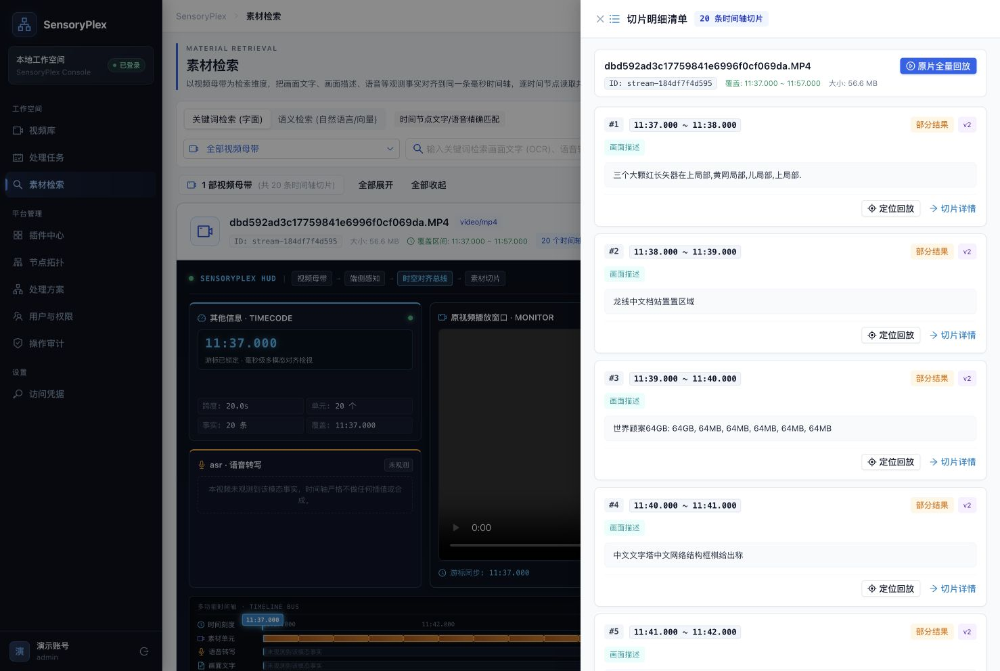
</p>

### 5. 可编排多模态流水线与全景甘特执行时序 (DAG Pipeline & Execution Gantt)
> **声明式 DAG 调度与毫秒级时序跟踪**：将多模态处理解耦为阶段拓扑泳道流（数据面输入 ➔ L1 判别快路径 ➔ 时间轴融合 ➔ L2 延迟补全慢路径），配合全景甘特时序图精确反映各算子的在飞状态与执行耗时；支持灵活配置 PP-OCR、MLX-Whisper、Moondream 等模型算子参数与超时重试策略。

<p align="center">
  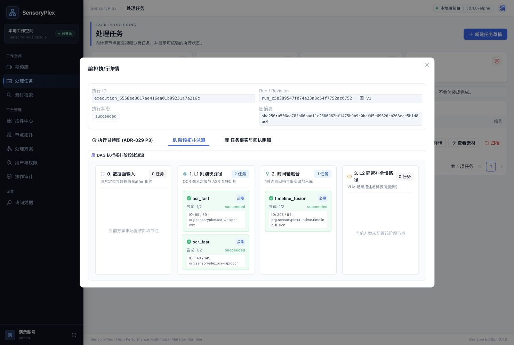
  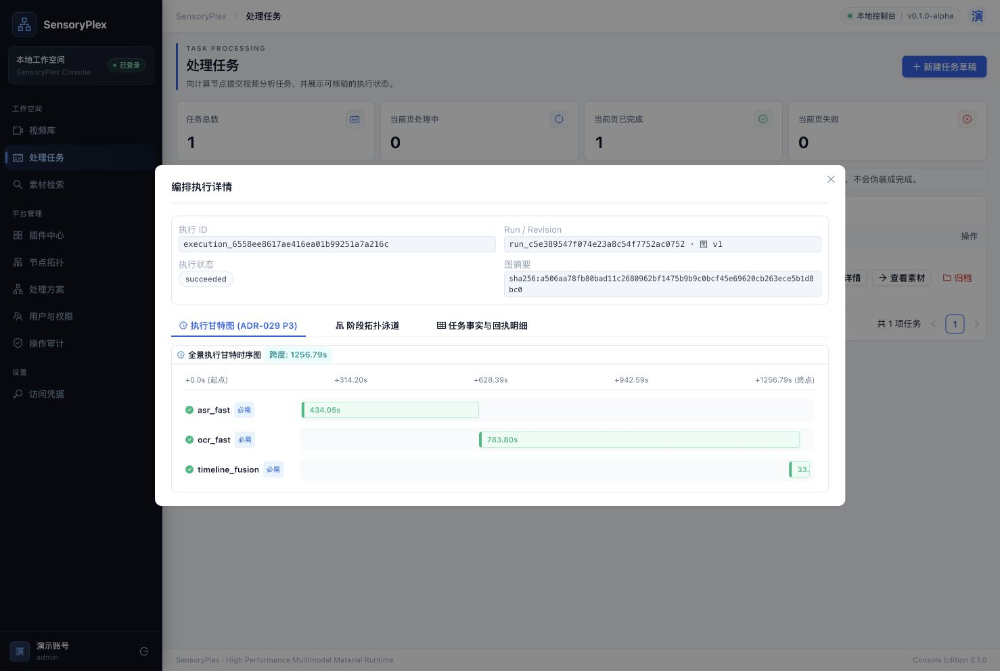
</p>
<p align="center">
  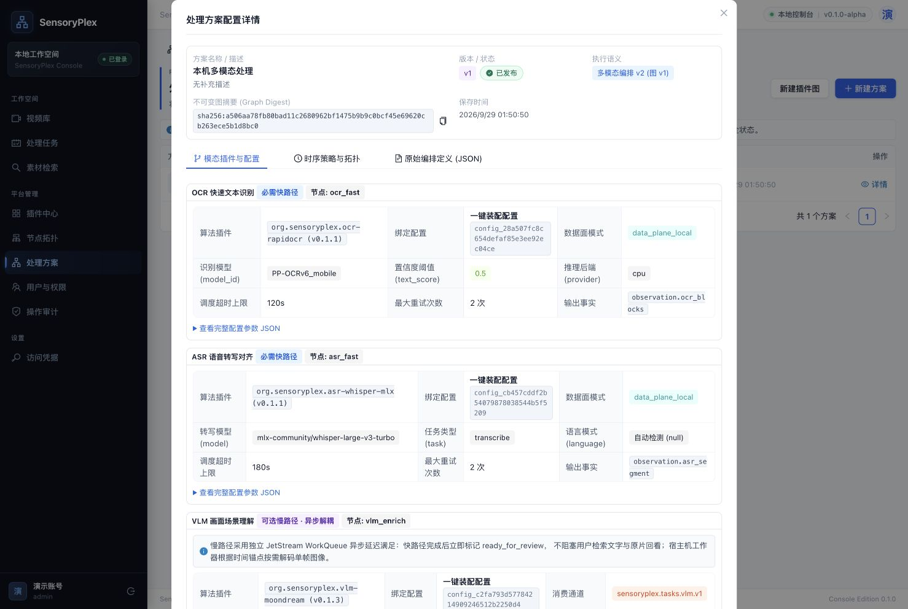
</p>

### 6. 边缘算力集群拓扑与版本化蓝绿热部署 (Fleet Topology & Hot-Deploy)
> **异构算力感知与零停机平滑演进**：
> - **节点拓扑看板**：实时探查同机与局域网分布式节点的 CPU/统一内存负载、硬件加速引擎（Apple Silicon Metal / CoreML / NVIDIA CUDA）及共享内存（LeaseBuffer）零拷贝数据交互模式；
> - **插件热部署 (ADR-030)**：实现首方自研 Python 原生插件的独立进程版本化双槽位蓝绿热部署，通过身份/摘要核对、参数校验及连续健康度门禁保障无感平滑切换与失败零影响。

<p align="center">
  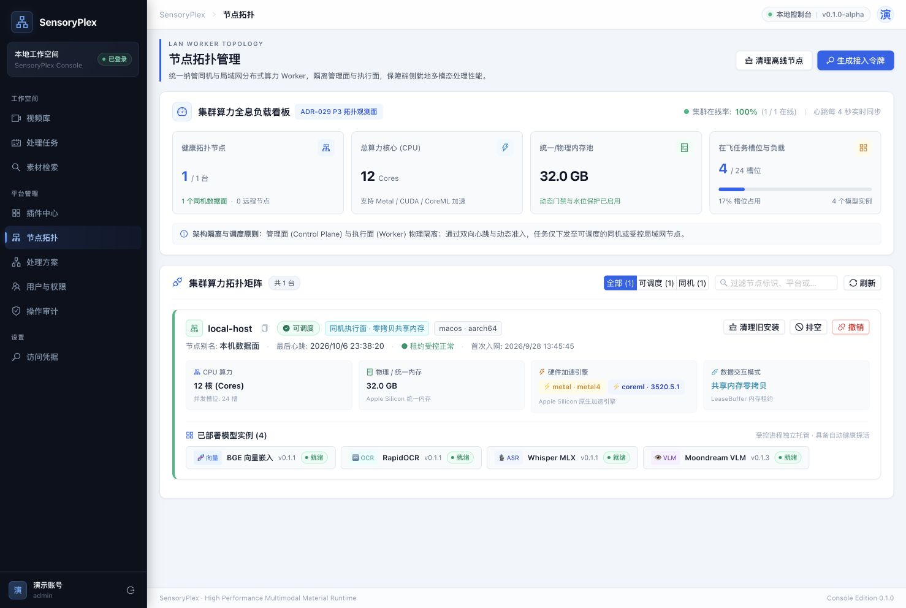
</p>
<p align="center">
  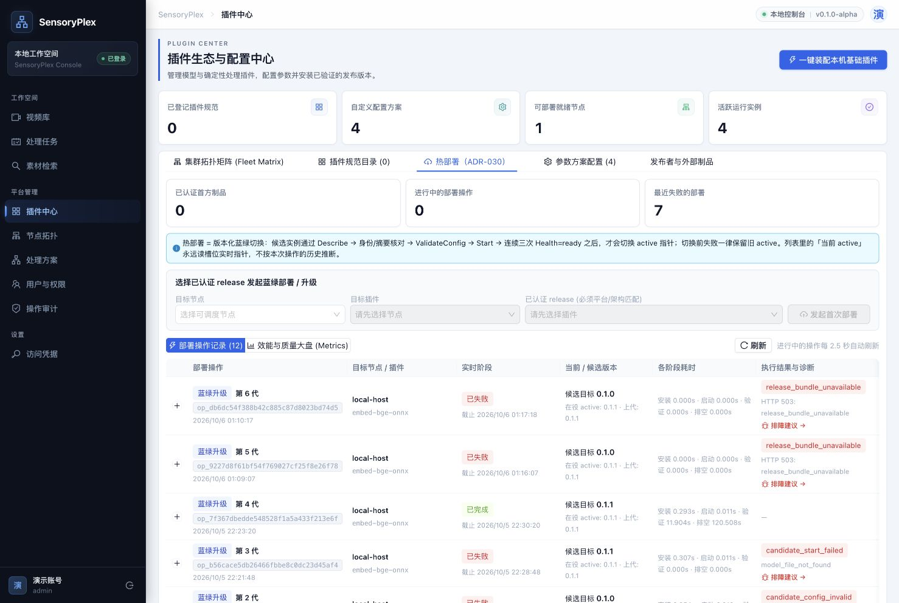
</p>

### 7. 原始视频资产库与全链路操作审计 (Media Assets & Audit Trail)
> **资产入库准入与严格合规审计**：支持原始音视频母带存储、媒体格式准入与时长探测；所有会话登录、节点预检、流水线发布与插件热部署操作全量留痕，敏感凭据与业务介质严格脱敏。

<p align="center">
  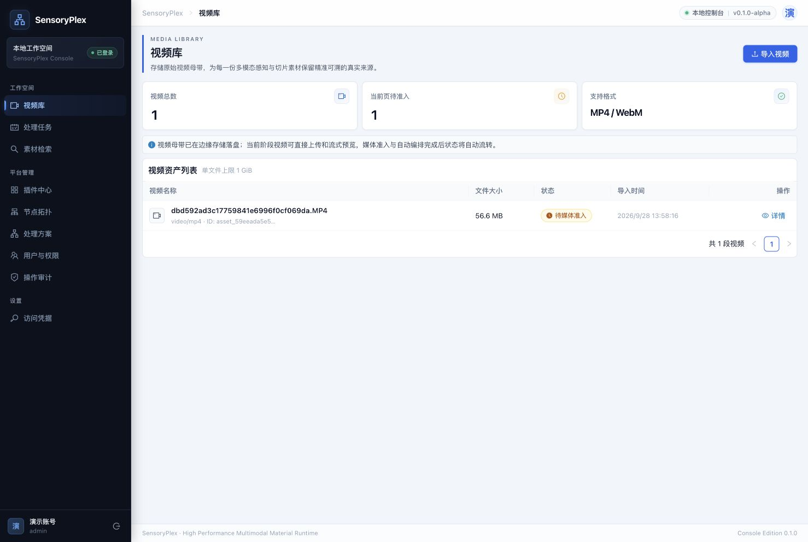
  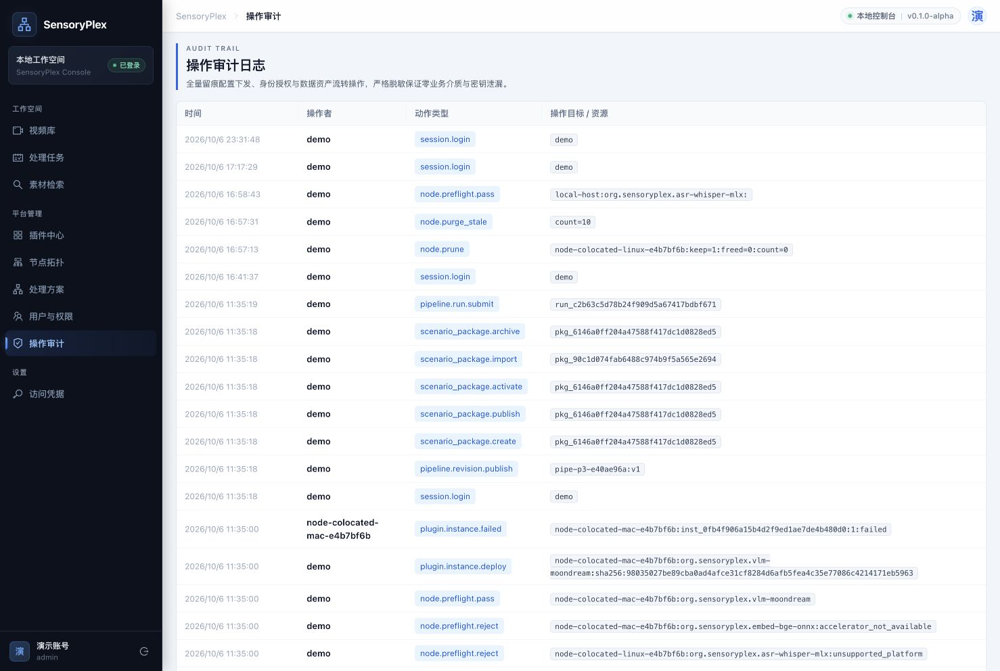
</p>

---

## 🌟 开源社区共建与核心工程红线 (Community & Guidelines)

> **致社区开发者**：SensoryPlex 是一个面向边缘异构硬件的高性能底层基础设施。我们宣布全面开源，并热忱欢迎音视频流处理（GStreamer/FFmpeg）、端侧 AI 加速（Metal/MLX/CUDA/NPU）、分布式事件流（NATS/PostgreSQL）及全栈前端领域的优秀工程师加入维护团队，共同推动项目的长期演进！

### 1. 核心工程红线（所有贡献者必须严格遵守）
为保证底层框架的严谨性与生产确定性，任何 PR 均须遵循以下**不可妥协的工程红线**（详见 [CONTRIBUTING.md](CONTRIBUTING.md)）：
- **底座强制容器，子节点插件走原生**：核心控制面（api / gateway / console / postgres / nats / relay / index）的构建、迁移与验证**一律强制在 Docker 容器内执行**，消除开发环境漂移；端侧模型插件强依赖物理硬件加速（Metal/CoreML/CUDA/NPU），**允许宿主原生运行**。
- **`proto/` 是唯一跨语言契约源**：所有跨进程/跨语言接口修改必须先改 Proto，并执行 `make proto` 提交生成代码；严禁手工篡改生成文件。
- **不可变事实与单调递增追加**：已入库素材事实严禁原地更新；数据库迁移只允许单调递增追加并通过 `tools/migrate.py` 执行，禁止修改历史 revision。
- **时间轴绝对基准（1秒连续切片）**：严格以同一流的 `[start_ms, end_ms)` 毫秒建立完整切片网格；模型未返回或无内容时只记录来源引用与待补充/无文字状态，**严禁虚构 Observation 或合成空秒素材**。
- **诚实性与零静默降级**：未知状态（缺失置信度/未知 PTS/未探测加速器）必须显式标记并记录原因码；**严禁合成业务假数据，严禁用健康检查通过伪造端到端测试证据**。
- **零明文数据面与零凭据泄露**：控制消息、日志、状态行及事件中**严禁传输原始帧、PCM 音频、Tensor 矩阵、密钥或宿主绝对私有路径**。
- **严格有界性与可观测性**：所有队列、并发及窗口必须设置硬上限，超时与失败具备结构化错误码，严禁无界缓冲。

### 2. 社区共建与成长梯队
我们推行开放透明的维护者阶梯，优秀贡献者将共同主导项目治理：
- **Contributor** ➡️ **Reviewer / Triager** ➡️ **Committer** ➡️ **Maintainer / PMC**
- 详细晋升机制、职责与治理准则请参阅 [贡献指南 (CONTRIBUTING.md)](CONTRIBUTING.md)。

### 3. 开源规范入口
- 📘 **贡献指引与提交流程**：[CONTRIBUTING.md](CONTRIBUTING.md)
- 🤝 **社区行为准则**：[CODE_OF_CONDUCT.md](CODE_OF_CONDUCT.md)
- 🛡️ **安全策略与漏洞披露**：[SECURITY.md](SECURITY.md)
- 📜 **开源许可证**：[Apache License 2.0](LICENSE)
- 🌐 **在线开源文档站**：[https://zhipentu.github.io/SensoryPlex/](https://zhipentu.github.io/SensoryPlex/)

---

## 快速开始

底座开发需要 Docker Compose v2，Rust 1.96、Python 3.12 等底座工具链在容器内执行；
宿主原生 Worker 的 uv、Python 与本平台构建工具按对应验收链路准备。目标平台为 `macos-aarch64`
（Apple Silicon，含 Mac mini 端侧部署）与 `linux-x86_64`（NVIDIA 性能主线）；macOS 侧
加速进程需原生运行，容器无法访问 Metal/CoreML。

开发验证默认在容器内执行（`EXEC_MODE=container`，见 Makefile 顶部）。没有本机 compose
栈的环境可以用 `EXEC_MODE=host` 把同一组命令退回主机（`uv run --frozen python` + 主机
`cargo`），例如 `make check EXEC_MODE=host`；远端 CI 的各 job 都是这样跑的。
没有 PostgreSQL 的主机（如 macOS runner）改跑 `make lint-ruff test-contracts`，
集成测试只由带数据库的 job 覆盖。

GitHub Actions 仅保留手动触发，不会因 `push` 或 PR 自动消耗托管 runner 额度。日常门禁在本机完成：
底座 Python/Node 验证通过容器执行，Rust 底座构建与验证默认使用专用 `rust` 容器；macOS 硬件验证与
宿主原生执行器所需构建按 `AGENTS.md` 的边界使用宿主工具链。需要独立的
远端复核时，在 Actions 的 **Run workflow** 手动运行；只有勾选 `run_apple_silicon` 才会启动计费较高的
macOS 作业。未执行的远端 macOS 作业不能表述为已通过。

```sh
make setup
make up
```

打开 [API 文档](http://127.0.0.1:8090/docs)。认证 token 在自动生成且被 Git 忽略的
`.env` 中。初始数据库没有业务数据，搜索返回空数组；工程不会自动生成模型结果。

本地源码开发、端口、测试、迁移和回滚见 [开发手册](docs/runbooks/development.md)。
OBS 本机推流可执行 `make stream-up`，配置与接流地址见 [OBS 推流手册](docs/runbooks/obs-streaming.md)。

作为开源框架的使用文档是**静态文档站** `apps/docs`（VitePress，英文在 `/`、简体中文在 `/zh/`），
由 `./deploy/up.sh` 一并拉起，访问 <http://127.0.0.1:5174>。它是纯静态产物，可托管到任何静态服务器：

```sh
make docs-install     # 一次性在 docs 容器内装依赖（唯一需要 npm registry 的步骤）
make docs-check       # 构建 + 语言树对等 + 产物内部链接/资源校验（提交前门禁）
make docs-dev         # 带热更新的本地预览（http://127.0.0.1:5175）
make docs-build       # 产出可托管产物到 apps/docs/.vitepress/dist
```

文档站的能力描述只包含已验证结论，三态标签（已验证 / 未验收 / 未实现）与证据命令见
[能力实现状态](apps/docs/reference/status.md)。

```sh
make check
make integration
make pipeline-check
make runtime
make media-replay MEDIA=/absolute/path/to/authorized-sample.mp4
make handoff-check MEDIA=/absolute/path/to/authorized-sample.mp4
make media-test
make stream-up && make live-check
```

`make media-test` 只跑解码路径的单元测试（含保留表按种类分配的 A/B 回归），需要 GStreamer 开发文件。

端侧模型插件的验收都是**四个进程**（编排 / 生产者 runtime / 插件 / worker），各需要一份真实授权样本：

```sh
make model-check MEDIA=/absolute/path/to/authorized-sample.mp4    # VLM（本机 ollama）
make asr-check   MEDIA=/absolute/path/to/authorized-speech.webm   # ASR（本机 MLX Whisper）
make ocr-check   MEDIA=/absolute/path/to/authorized-video.webm    # OCR（随包 PP-OCR ONNX）
make embed-check MEDIA=/absolute/path/to/authorized-video.webm    # BGE 文本向量（随包 BGE ONNX，消费上游 OCR 文字）
```

`make ocr-check` 支持 `EXPECT=empty`：无文字样本上"0 块 + `empty_reason`"才是正确结果，
用它证明"模型没找到文字"与"处理失败"可区分；`PROVIDER=coreml` 走 CoreML 执行后端，
拿不到 CoreML 会话会显式失败（不静默退回 CPU，见
[ADR-016](docs/adr/ADR-016-OCR与ONNX执行后端.md)）。

`make index-check EMBEDDINGS=/absolute/path/to/ai-worker.json` 把这份真实向量接进
**落库与检索闭环**（ADR-020）：`services/index-worker` 写进 Milvus 并读回确认后才置 `ready`，
检索命中必须回查 PostgreSQL 的 `ready` + material + `source.owner` 才返回；真实 PostgreSQL
（隔离 schema + 真实迁移）与真实 Milvus Lite 上 11 个场景全过。输入取自
`uv run --frozen python tools/verify_embed.py --media <sample> --keep-workspace` 产出的
`ai-worker.json`。注意 Milvus Lite **是进程独占的**（同一数据目录不能被两个进程同时打开），
服务端形态未验收，见 [ADR-020](docs/adr/ADR-020-向量索引落库与检索闭环.md)。

`make outbox-check` 把事务性 outbox 接进 **NATS JetStream**（ADR-024）：真实 `EventEnvelope`
落库后由 `services/outbox-relay` 发布，脚本再把消息从 JetStream 拉回来逐字节对账（subject、
`Nats-Msg-Id`、载荷），并验证重放去重、漂移不被静默修好、NATS 不可达时**一行都不写**。
这个目标在 api 容器内执行（只要真实 PostgreSQL 与真实 JetStream，都在 compose 里）。
`make outbox-run` 是同一入口的常驻形态。**边界**：它是"发布这一跳"，
所以通过**不代表**向量已被事件驱动地写进去了。

`make consume-check` 补上**消费这一跳**（[ADR-025](docs/adr/ADR-025-常驻消费循环与sink接线.md)，
**主机执行**：Milvus Lite 的数据目录是进程独占的本地文件、BGE 权重也只在本机）：真实写侧
（素材 + 观测 + outbox 同事务）→ 真实 relay → 真 NATS JetStream → `sensoryplex-index serve
--consume` 常驻消费 → 真实 BGE 编码写入真实 Milvus Lite → **同一个进程**的 gRPC 检索面立刻
检索到；另验换 durable 重放不重复、坏事件重投到上限 fail-stop（**退出码 3**，不 ack 不记账）、
启动期三类显式失败（stream 缺失 / durable 漂移 / NATS 不可达）与状态行不外泄。

`make events-up` 把两个常驻服务放进 compose 的 `events` profile（`make events-down` / `events-logs`），
`make event-pipeline-check` 则是**容器内**的端到端验收（[ADR-027](docs/adr/ADR-027-事件链路分级背压与容器化常驻.md)）：
真实写侧（素材 + 观测 + outbox 同事务）→ **compose 里常驻的** relay → 真 JetStream →
**compose 里常驻的** index（真 BGE → 真 Milvus Lite → 检索面同进程）→ 运行中 api 的
`POST /v1/materials:search`（`mode=semantic`，真 gRPC）命中且排第一；另验两个状态行的准入对账、
一条越界配置被真实 relay CLI 拒绝启动、事实回查挡 stale、清理为 0 与不外泄。与 `make consume-check`
的分工：那个验**单进程内**的消费正确性（主机执行），这个验**两个常驻服务在 compose 里真的把链路跑通**。
事件链路的深度上限来自分级的**独立一列** `SENSORYPLEX_EVENT_QUEUE_CAPACITY`（`medium` 档 32）：
relay 的 `--batch` 与 `--consume-batch` 越界即 `event_inflight_exceeds_tier_cap`，缺变量是显式
`not_injected` —— 与媒体面同一口径，不夹取、不改写。

`make timeline-check MEDIA=/absolute/path/to/authorized-sample.mp4` 是**真实媒体**从 Runtime 走到
素材事实的那一段（[ADR-028](docs/adr/ADR-028-Runtime到Timeline接线与授权追加.md)，**主机执行**：
runtime 二进制是主机 Mach-O，容器里 `Exec format error`，真实 VLM 端点也只在主机；
PostgreSQL 与 NATS 仍在 compose 里，从宿主回环端口连）：真解码 + 真 lease → 真插件观测 →
`sensoryplex-runtime timeline`（按 pipeline 声明的栅格选窗、逐条准入、调融合核心）→
授权写入口 `tools/timeline_handoff.py`（登记引用事实 + 真写侧追加，事实与 outbox 同事务）→
真 relay `--once` 把事件确认发到真 JetStream。实测：6 帧观测 → 7 窗（5 窗有观测）→ 5 条素材、
`rejected=0`；入库字节与磁盘 protobuf 逐字节相同；第二遍追加 `appended=0 replayed=5`、relay 第二遍
`published=0`；owner 漂移 / 同 revision 换内容 / 报告视图被改三类失败都显式拒绝。
**边界**：`make timeline-check` 自己只接文件源与单次运行（`revision=1`），且只有 VLM 一种模态
⇒ 每条素材 `status=partial`；它停在"事件已发到 JetStream"。

`make timeline-resident-check MEDIA=/absolute/path/to/authorized-sample-with-text.webm` 是同一段链路的
**续篇**：融合出的素材由 compose 里**常驻**的 `relay` / `index`（`make events-up` 的 `events` profile）
搬走并编码成向量，再由运行中 api 的 `POST /v1/materials:search`（`mode=semantic`）命中。它与
`timeline-check` 的分工是"**不隔离**"——必须落在常驻进程真正在盯的那份库与那条 stream 上，否则
"常驻搬走了它"就无从谈起，因此脚本**刻意不清理**自己写下的行（素材 / outbox / `consumed_event` 与
向量行就是凭据）。同样固定在**主机执行**（runtime 二进制是主机 Mach-O，真实 OCR 权重与本机模型端点
只在主机）；样本必须**带文字**。实测（`editing-basics-sandboxes.vp8.webm`）：5 条素材 / 6 条可编码观测
→ 常驻搬运 `published +5` / `consumed +5` / `embedded +6` → 6 行向量 `ready` → 语义检索 **28 条命中里
包含本次全部 5 条素材**，用作查询的那条观测相似度 `1.0000`；第二个样本
（`officehours-panel.480p.vp9.webm`）同样通过，并真的遇到 1 条空文本观测 → 按原因计数跳过而不是
fail-stop（两个常驻容器 `RestartCount=0`）。证据见
[验证记录](docs/verification.md) 的"真实媒体端到端（续）"。
**边界**：HTTP 查询**回看**、`revision` 前进、SRT 实时源与向量 GC 仍未验收 ⇒ `golden_path_verified`
仍是 `false`。

`make embed-check` 是唯一**不接数据面**的链路：它先跑一遍真实 OCR 产出文字块，再让 BGE 消费这些
文字（`acceptsMemoryKinds: []`，喂字节以 `buffer_reader_not_attached` 明确拒绝），产出维度版本化的
L2 归一化向量。想跳过 OCR、直接复用已有的 `ai-worker.json` 时传
`OBSERVATIONS=/absolute/path/to/ai-worker.json`；`PROVIDER=coreml` 同样可用，但实测**更慢**
（同文本 0.78 ms vs 3.16 ms），见 [ADR-017](docs/adr/ADR-017-BGE文本向量与维度版本化.md)。

macOS 常驻形态（`launchd`）在主机的**用户级** LaunchAgents 中运行，按统一内存分级设置上限
（设计见 [ADR-015](docs/adr/ADR-015-macOS常驻形态与统一内存分级.md)，操作见
[macOS 常驻手册](docs/runbooks/macos-resident.md)）：

```sh
make resident-probe     # 只读：打印分级与上限
make resident-install   # 渲染 plist + launchctl bootstrap
make resident-status    # 两个 job 状态，--verify-endpoint 做一次真实 gRPC 调用
make resident-uninstall
```

`launchd`/`launchctl`/`sysctl` 只存在于 macOS 宿主，所以这一组是明确的"主机例外"，不放进容器目标。

分级表里的**模型并发**那一半由模型 worker 消费（[ADR-021](docs/adr/ADR-021-模型worker按分级并发上限限流.md)）：
`tools/ai_worker.py` 按 `--model-parallelism` / `SENSORYPLEX_MODEL_PARALLELISM` 与运行时转述的分级上限
做准入与在飞调用限流（坏值、来源冲突与越界在连插件之前 exit 2，**不夹取**），报告里的
`model_concurrency` 记实测 `peak_in_flight` 与重试账目——可重试拒绝（`concurrency_limit` /
`deadline_expired`）不再让输入静默消失：

```sh
make parallelism-check MEDIA="/abs/a.webm /abs/b.webm" INPUTS=4
```

宿主**加速器**是另一件事，也不再被混进执行后端那张表（[ADR-022](docs/adr/ADR-022-宿主加速器能力探测与上报.md)）：
`DescribeCapabilities` 的 `host_accelerators` 真去探测宿主（macOS 走 `system_profiler` 与 CoreML
framework，Linux 走 `nvidia-smi`），三态 `available / unavailable / unknown` 不得互相塌陷——
探测工具缺失、超时或读不懂一律落 `unknown` 而**不是**"不存在"。它只回答"这台宿主有没有这块加速器"：
Rust 侧至今没有任何 in-process `ExecutionBackend`，`model_inference` 仍在 `unavailable_capabilities` 里。

```sh
make accelerator-check   # 四路对账：宿主直读 / LANG=zh_CN / PATH=/nonexistent / 与执行后端分离
```

`make media-replay` 需要 GStreamer 开发文件；没有的主机可加 `MEDIA_FEATURES=` 退回纯锚点报告
（解码数据平面保持全零，并在 `blockers` 中声明未实现）。`make handoff-check` 在同一份素材上再跑一次
跨进程数据面验收：Runtime 保留字节，独立 Python 进程按 lease 读取、校验摘要并释放，
越界与过期路径必须给出显式拒绝码。`make live-check` 需要先 `make stream-up`：脚本自己用 GStreamer
`srtsink` 把授权样本直推 SRT（不经 RTMP 转封装、不占用 OBS 会话），再跑四个场景
（稳定窗口、断流恢复、无源失败、实时数据面交接）。

## 素材工作台 (Web Console)

SensoryPlex 提供工业级前端 `apps/console`（React + TypeScript + Vite + Nginx）与模块化核心控制面 `services/api`（FastAPI），支持全流程可视化操作：
- **视频库管理**：上传本地母带，执行媒体准入与参数探查；
- **任务与编排**：基于不可变 DAG 流水线发布方案，派发处理任务并实时追踪甘特时序与阶段泳道状态；
- **素材与时间轴**：毫秒级 SENSORYPLEX HUD 仪表盘，1秒连续网格全覆盖切片，OCR/ASR/VLM 事实协同与原片流式回放；
- **向量语义检索**：集成常驻 BGE 向量索引与 Milvus Lite，支持自然语言跨视频秒级检索；
- **算力与插件**：实时监控异构计算节点拓扑（Metal/CUDA/CoreML 加速引擎感知）与自研插件版本化双槽位蓝绿热部署。

```sh
# 启动完整开发栈与常驻事件检索链路
./deploy/up.sh && ./deploy/up-events.sh

# 一键生成/重置演示账号（登录页自动激活快速登录按钮）
make demo-seed
```

本地浏览器访问 <http://127.0.0.1:5173> 即可进入工作台（开发期已提供 Demo 快速登录，无需手动输入凭据）。完整功能界面截图与详细解读请参阅上文 [📸 项目界面与核心功能全景 (Web Console Showcase)](#-项目界面与核心功能全景-web-console-showcase)。

## 工程结构

```text
proto/                  common / material / runtime / gateway 的版本化契约
crates/                 runtime、media、timeline、storage、execution、sdk
plugins/python/common/  edge_material_sdk 与生成的 Python 消息
apps/console/           React + TypeScript + Vite 素材工作台
apps/docs/              开源框架使用文档站（VitePress，多语言静态产物）
services/api/           模块化 Business / Admin / Identity API
services/gateway/       旧 Gateway 导入与启动兼容入口
services/outbox-relay/ 事务性 outbox → NATS JetStream 的 relay（ADR-024）
services/index-worker/ 向量落库与检索面：常驻消费（JetStream → sink）+ gRPC 检索（ADR-020/023/025）
db/migrations/          只追加的显式 PostgreSQL 迁移
config/pipelines/       文件与 SRT 实时接入的 pipeline 配置
deploy/compose/         本地容器基础设施
deploy/macos/           macOS launchd 常驻模板与分级包装脚本（ADR-015）
tests/                  契约测试、真实 PostgreSQL 集成测试、媒体样本说明
tools/                  配置、代码生成、迁移、测试与真实媒体探测
```

## 设计依据与状态

- [技术选型 ADR 与 V1 实施蓝图](技术选型ADR与V1实施蓝图.md)
- [开源文档站源码（VitePress，多语言）](apps/docs/index.md)
- [开放式插件开发文档](开放式插件开发文档.md)
- [素材工作台 MVP 工程设计稿（应用准备流程已实现）](docs/design/console-mvp.md)
- [ADR-021：模型 worker 按分级并发上限限流（准入、重试与账目）](docs/adr/ADR-021-模型worker按分级并发上限限流.md)
- [ADR-022：宿主加速器能力探测与上报（三态、只写真值、与进程能力分离）](docs/adr/ADR-022-宿主加速器能力探测与上报.md)
- [ADR-023：网关语义检索接线与索引检索面（进程独占、同源守卫、状态码与 retryable 分野）](docs/adr/ADR-023-网关语义检索接线与索引检索面.md)
- [ADR-026：Web 主节点与局域网插件 worker 拓扑（已验收，生产级 mTLS/HA 待后续阶段）](docs/adr/ADR-026-Web主节点与局域网插件worker拓扑.md)
- [ADR-027：事件链路的分级背压准入与容器化常驻（relay / index 进 compose）](docs/adr/ADR-027-事件链路分级背压与容器化常驻.md)
- [ADR-020：向量索引落库与检索闭环](docs/adr/ADR-020-向量索引落库与检索闭环.md)
- [ADR-019：运行时消费分级队列上限（准入，而不是改写）](docs/adr/ADR-019-运行时消费分级队列上限.md)
- [ADR-015：macOS 常驻形态（launchd）与统一内存分级](docs/adr/ADR-015-macOS常驻形态与统一内存分级.md)
- [ADR-014：ASR 插件与音频样本布局契约](docs/adr/ADR-014-ASR插件与音频样本布局契约.md)
- [ADR-013：应用 API 模块化合并与部署边界](docs/adr/ADR-013-应用API模块化合并与部署边界.md)
- [ADR-009：媒体格式支持矩阵与拒绝语义](docs/adr/ADR-009-媒体格式支持矩阵与拒绝语义.md)
- [ADR-010：跨进程数据面的安全边界与可见性](docs/adr/ADR-010-跨进程数据面的安全边界.md)
- [实现状态与后续阶段](docs/implementation-status.md)
- [开发执行清单](docs/development-checklist.md)
- [契约与查询语义](docs/contracts/README.md)
- [初始化验证记录](docs/verification.md)

跨服务消息必须先修改 Proto；模型结果必须携带时间锚点、来源、版本和置信度语义。
控制总线不传媒体 bytes。未知、失败、冲突与降级保持可见，测试 fixture 不能替代
真实视频/流与模型的端到端验收。


## 社区交流与支持 (Community & Support)

- **Issues & RFCs**: 提交 Bug 报告、新特性建议与架构 RFC 提案至 [GitHub Issues](https://github.com/ZhiPenTu/SensoryPlex/issues)；
- **Discussions**: 参与技术讨论与新硬件适配交流至 [GitHub Discussions](https://github.com/ZhiPenTu/SensoryPlex/discussions)；
- **核心维护与安全**: 发送邮件至 `50646043@qq.com`（安全漏洞通报、商业合作与核心治理）；
- **微信交流 (WeChat)**：欢迎扫码添加项目作者个人微信，备注「SensoryPlex」，加入开发者交流群：

<div align="center">
  
  <p><sub>扫码添加微信（备注：SensoryPlex）</sub></p>
</div>

## 许可证 (License)

SensoryPlex 遵循 [Apache License 2.0](LICENSE) 开源协议。
