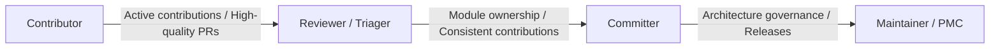

# Contributing & Governance

Welcome to the SensoryPlex open source community!

SensoryPlex is a high-performance edge multimodal material preprocessing framework. It integrates low-level media decoding (Rust / GStreamer), edge hardware acceleration (Apple Silicon Metal/MLX, CoreML, CUDA, NPU), streaming event buses and vector retrieval (PostgreSQL, NATS JetStream, Milvus Lite), and a modern Web console.

We believe that building an enterprise-grade, highly reliable, and heterogeneous edge infrastructure requires the collaboration of outstanding open source developers worldwide. We warmly invite contributors specializing in media streaming, edge AI optimization, distributed systems, and full-stack development to join us in maintaining and evolving SensoryPlex!

---

## Community Governance & Growth Ladder

SensoryPlex embraces an **open, transparent, meritocratic, and evidence-driven** culture. We have established a clear contributor growth pathway:



1. **Contributor**:
   - Anyone who submits a valid Issue, documentation fix, bug fix, test case, or feature PR that gets merged.
   - Acknowledged in the project Contributors hall of fame.
2. **Reviewer / Triager**:
   - Experienced with project architecture and engineering red lines; actively reviews community PRs, reproduces/triages GitHub Issues, and helps onboard new contributors.
3. **Committer**:
   - Demonstrates sustained and deep contributions in at least one core area (Rust crates, Python model processors, event pipeline, or console frontend).
   - Granted Write/Triage repository permissions and leads code reviews and merges for owned modules.
4. **Maintainer / PMC**:
   - Possesses overall architectural vision and leads roadmap planning, RFC decisions, release management, security response, and community stewardship.

---

## Call for Contributions & Roadmap Highlights

We invite community members to propose or lead implementations in these priority directions:
- **Heterogeneous Hardware & Edge NPU Adapters**: Support for NVIDIA Jetson (TensorRT), Huawei Ascend (CANN), Rockchip (RK3588/RKNN), and Intel OpenVINO.
- **Multimodal Perception Expansion**: Lightweight SOTA Vision-Language Models (InternVL, Qwen2-VL) and dedicated sensory plugins (Sound Event Detection, redaction).
- **Streaming Protocols & Codecs**: WebRTC and RTSP low-latency ingestion, AV1/H.265 hardware decoding, and dynamic frame extraction.
- **Production Topology & Hardening**: Automated mTLS certificate issuance/rotation across nodes and control-plane high availability (HA).
- **Web Console & User Experience**: High-performance rendering of extensive video timelines (virtualization, canvas tracks) and human-in-the-loop correction flows.

---

## Before You Write Code: Architecture & Execution Rules

Before writing code, please read in order:
1. The requirement documents in the repository root;
2. `docs/implementation-status.md` (to understand what is verified vs. unverified);
3. The ADRs covering the specific areas you intend to modify.

Any change contradicting an ADR must be accompanied by an ADR amendment or RFC proposal. ADRs are load-bearing architectural decisions, not historical notes.

### Where Code Runs (Container Base vs. Host Native)

| Layer | Rule & Location | Core Rationale |
| --- | --- | --- |
| **Control Plane Base** (`api`, `gateway`, `console`, `postgres`, `nats`, `relay`, `index`) | Build, lint, migrate, and validate **inside containers** via `docker compose exec -T <service> ...` | Eliminates "works on my machine but breaks in production" drift. Host environments should not install or call control-plane Python/Node tools. |
| **Sub-node Plugins & Workers** (`ocr-rapidocr`, `vlm-moondream`, `asr-whisper-mlx`, `task_worker.py`) | **Permitted to run host-native** | Deeply dependent on host physical hardware accelerators (Apple Silicon Metal/MLX, CoreML, CUDA, NPU). Lightweight Linux containers cannot mount or compile native drivers. |
| **Host System Exceptions** | `cargo` / Rust builds, `make configure` (credential generation), macOS LaunchAgent daemon management | Container images currently omit Rust toolchains; macOS `launchd` resident commands exist only on the host system. |

---

## Non-negotiable Engineering Red Lines

The following 13 core engineering principles guarantee system reliability, immutability, and determinism. All PRs are strictly audited against them:

1. **`proto/` is the single cross-language contract source.** Never hand-edit generated code. Modify Proto files first, run `make proto`, and commit regenerated outputs.
2. **Field numbers are permanent.** Removed fields must be marked `reserved`; breaking changes require a new protocol major version.
3. **Migrations are strictly append-only.** Database schema changes must be monotonically incremental migrations executed via `tools/migrate.py`. Never modify historical revisions.
4. **No synthetic business data.** Never fabricate model outputs, chart series, or synthetic test passes. Missing results must return empty with explicit reasons.
5. **Unknown stays unknown.** Missing confidence, unknown PTS, or unprobeable accelerators must be reported as unknown with reason codes, never defaulted.
6. **No raw media or secrets outside the data plane.** Raw frames, PCM audio, tensors, credentials, and host private absolute paths must never enter control messages, events, or logs.
7. **Every queue and concurrency limit is bounded.** Concurrency and buffer queues must be constrained by tier caps. Timeouts and errors must carry observable structured semantics.
8. **Real evidence principle.** Media end-to-end paths must be validated with real authorized samples (`tests/fixtures/media/OPEN-SAMPLES.md`). Skipped tests, unexecuted CI jobs, or healthy containers do not constitute proof.
9. **Deterministic orchestration & cancellation first (ADR-029).** Upstream success cascades unlock downstream tasks; upstream failure blocks downstream tasks. Cancelled jobs discard late arrivals safely.
10. **Hot-deploy blue-green isolation (ADR-030).** Native plugin deployment uses dual-slot isolated processes. New versions require 3 consecutive healthy probes before atomic cutover. Installation is 100% offline.
11. **Slow path asynchronous decoupling (ADR-031).** Compute-heavy models (VLM) run via NATS WorkQueue. Fast paths (OCR/ASR) advance to `ready_for_review` immediately without blocking user inspection.
12. **Absolute timeline grid (1-second slices).** The timeline establishes an immutable 1-second slice grid across `[start_ms, end_ms)`. Never synthesize fake observations or empty-second entries.
13. **Bilingual comment convention.** Hand-written Rust and Python comments default to Chinese; Proto contracts and generated code remain English; technical terms (GStreamer, gRPC, NATS, ADR) retain their English names.

---

## Local Verification Expectations

Run the checks covering your scope locally before submitting a PR, and paste the command outputs in the PR description:

```sh
# Static checks and contract tests (in container)
make lint-ruff
make proto
make test-contracts

# Integration and pipeline checks (in container)
make test-integration
make orchestration-p1-check
make event-pipeline-check

# Full repository gate (including Rust formatting and tests)
make check
```

---

## Contribution Workflow

1. **Fork the repository** and create a feature branch off latest `master` (e.g., `feat/whisper-large-v3`);
2. **Format commit messages**: Follow Conventional Commits (`feat:`, `fix:`, `docs:`, `refactor:`, `test:`);
3. **Submit a Pull Request**:
   - Complete `.github/pull_request_template.md`;
   - Check off each item in the Engineering Red Lines Checklist;
   - Attach actual terminal verification evidence (`make check` output);
4. **Code Review**: At least one approval from a Committer or Maintainer is required for merge.

---

## RFC Process (Architectural Decisions)

For major architectural proposals (breaking Proto upgrades, heavy external dependencies, or new deployment topologies):
1. Copy `.github/ISSUE_TEMPLATE/rfc_template.md`;
2. Open an issue on GitHub with title `[RFC] <Proposal Title>`;
3. Drive community review and build consensus;
4. Archive approved design decisions into ADR documentation before implementation.

---

## Continuous Integration Policy

GitHub Actions workflows are **manual-only** by design to conserve hosted runner resources. Daily quality gates run locally.
Expensive macOS runner jobs execute only when `run_apple_silicon` is explicitly checked on manual dispatch. Unexecuted remote macOS jobs must never be claimed as passed.

The documentation site follows the same rule: `docs-pages.yml` publishes `apps/docs` to GitHub Pages only upon manual trigger.

---

## Community & Support

- **GitHub Discussions**: Discuss new ideas, edge hardware adaptations, and Q&A.
- **GitHub Issues**: Report bugs, track feature requests, and submit RFCs.
- **Maintainer Email**: `50646043@qq.com`.
- **WeChat Developer Community**: Scan the QR code below to connect with the author (please note "SensoryPlex") to join the group:

<div style="text-align: center; margin: 24px 0;">
  
  <p style="margin-top: 8px; font-size: 13px; color: var(--vp-c-text-2);">Scan on WeChat (Note: SensoryPlex)</p>
</div>

---

## Contributing to Documentation (apps/docs)

The documentation site is built with VitePress and supports English and Simplified Chinese, located in `apps/docs`:

```text
apps/docs/
├── .vitepress/config.mts     # locales, nav, sidebars, edit links
├── public/                   # favicon.svg / logo.svg, copied verbatim into artifacts
├── scripts/check-docs.mjs    # locale parity + built-link validation (zero dependencies)
├── <page>.md                 # English pages (served at /)
└── zh/<page>.md              # Chinese pages (served at /zh/)
```

Assets reside in `public/`, **not** `.vitepress/public/`.

### Adding or Editing Pages

1. Create or edit pages in the English tree (`apps/docs/<section>/<slug>.md`).
2. Mirror edits in the Chinese tree (`apps/docs/zh/<section>/<slug>.md`) — **both locales must contain the page**.
3. Update both sidebar configs in `.vitepress/config.mts` (`EN_SIDEBAR` and `ZH_SIDEBAR`).
4. Run `make docs-check` to validate internal links, assets, and language symmetry.
