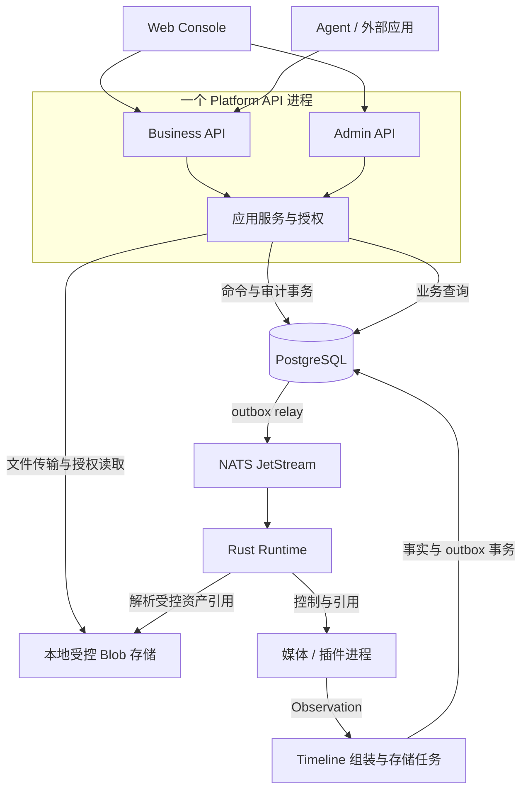
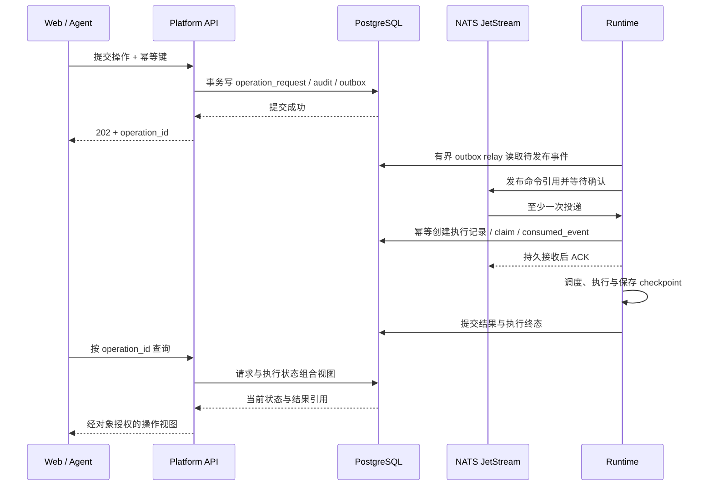

# SensoryPlex 素材工作台 MVP 工程设计稿

- **文档版本：** D0.1
- **日期：** 2026-09-23
- **状态：** 部分实施；Web 与模块化 API 的独立应用准备流程已交付，Runtime 接线和完整业务闭环未完成
- **架构决策：** [ADR-013：应用 API 模块化合并与部署边界](../adr/ADR-013-应用API模块化合并与部署边界.md)

本轮实施范围见 [Console 运行手册](../runbooks/console.md)：登录、权限、文件保存与预览、
插件配置、方案/任务草稿、真实素材查询、凭据和审计。本文下述完整 MVP 目标与初始能力盘点
仍保留为设计基线，不等同于当前完成状态；安装、发布、任务执行等底座动作维持明确不可用。

## 设计摘要

- **工程形态：** 同仓库，独立 Console 前端，一个模块化 Platform API 后端，独立 Rust Runtime 与插件进程。
- **接口边界：** Business/Gateway 与 Admin 分模块、分权限，首版本地部署共用进程；有隔离需求再拆进程。
- **最小价值：** 真实视频导入、VLM 描述、素材持久化、关键词检索、原片回看，以及插件安装到卸载的管理流程。
- **交付标准：** 浏览器贯穿真实媒体、真实模型和真实数据库；任务可恢复、事实可追溯、失败可解释。
- **实施重点：** 先补任务/资产/事实链路，再接界面；当前模型验证报告和可查询数据库尚未组成产品闭环。

架构与目录见 §3–4，页面见 §5，状态与契约见 §7–10，实施及验收见 §13。

## 1. 产品目标与范围

基于 SensoryPlex 底座交付一个单节点素材工作台。用户从浏览器导入授权视频，选择已发布的处理方案，
得到可追溯的视觉描述素材，通过关键词找到素材，并跳转播放原片对应时间点。
管理员在同一界面中管理插件、模型配置、Pipeline 模板和节点状态。

### 1.1 两条必须完成的流程

**业务流程：** 登录 → 导入视频 → 格式准入 → 选择 Pipeline → 创建持久任务 → 真实模型处理 →
MaterialUnit 入库 → 关键词检索 → 详情与血缘 → 原片定位播放。

**管理流程：** 查看受控插件目录 → 安装真实产物 → 配置模型依赖 → 验证就绪 → 发布 Pipeline →
用于真实任务 → 停用 → 解除引用并卸载；已有素材继续可查询与回看。

### 1.2 MVP 范围

| 维度 | 本版范围 | 后续范围 |
| --- | --- | --- |
| 部署 | 单机、单 Runtime 节点、受控本地访问 | 多节点调度、公网部署、复杂多租户 |
| 输入 | 浏览器上传本地文件；只开放通过准入与浏览器回看双重验收的格式 | SRT 持续录制、直播 UI、目录监听 |
| 处理 | 固定模板：真实解码 → 自适应抽帧 → 一个真实 VLM → 素材组装 | ASR/OCR、多模态融合、可视化 DAG 编辑 |
| 检索 | 既有关键词字面子串语义，叠加 owner、视频和时间过滤 | Embedding、Milvus、语义排名 |
| 插件 | 单一受控 Processor 类型，安装/配置/启停/卸载 | 全类别安装器、第三方公开投稿、评分、支付 |
| 媒体 | 原片授权读取、Range 请求、时间点回看 | 通用预览转码、切片下载、剪辑 |
| 协议 | Web 与外部应用使用相同业务 REST | MCP、对外 gRPC 的正式服务接线 |

这是“本地视觉素材工作台”的完整流程，不替代根需求中 ASR + OCR + VLM + 向量检索、2–5 秒语义可见性的
完整 Golden Path。不得仅因工作台可用而把既有媒体报告的 `golden_path_verified` 改为 true。

首个候选插件是仓库中的 `vlm-moondream`，它只是现有接线基础；模型输出质量不稳定，正式选型由 §13 的质量验收决定。

## 2. 当前能力与工程缺口

下表依据本次阅读的代码与[实现状态](../implementation-status.md)，不是本轮重新执行媒体测试的结论。
已有未提交的媒体格式准入改动不作为完成证据，验收以合入后的代码和验证记录为准。

| 范围 | 已有基础 | 本版需要完成 |
| --- | --- | --- |
| Gateway | FastAPI、静态 Bearer token、owner 过滤、关键词和素材详情 | 模块化 API、会话/角色/scope、上传、任务、回看和管理接口 |
| Runtime | 能力查询、媒体 replay/ingest、有界数据面、lease 路径 | 常驻任务消费、持久执行状态、恢复、插件托管 |
| 模型 | 真实帧经插件得到带血缘的 observation；验证工具输出报告 | 正式任务调用、结果持久化、可安装产物、质量基线 |
| Timeline | MaterialUnit/Observation 校验 | 从真实 observation 组装素材与来源引用 |
| 存储 | 表结构、不可变版本、事务事实写入与 outbox | 生产写入路径、Blob adapter、命令分发、outbox 消费与补偿 |
| 身份 | 一个部署 token 映射一个 principal | 浏览器会话、管理权限、可撤销业务凭据、审计 |
| 界面 | 没有应用前端 | 独立 `apps/console`、真实 API 接线与浏览器验收 |

已有 `tools/ai_worker.py` 和 `tools/verify_model.py` 是接线/验收工具，不直接充当生产任务服务。
现有 `services/gateway/.../repository.py` 同时包含查询与内部事务写入；重构时迁移写入职责，保持既有事实校验语义。

## 3. 架构与服务边界

### 3.1 一套 API 后端，两个逻辑入口



Timeline 与存储任务首版是 Runtime 托管的有界执行模块，不额外启动微服务。
outbox relay 是 Runtime 内独立有界任务，单独控制查询、批次和重试；不在媒体回调中访问数据库。
NATS 只传契约消息与引用，不传视频、帧、PCM、tensor 或密钥。

### 3.2 权责与状态归属

| 组件 | 拥有的责任 | 不应承担 |
| --- | --- | --- |
| Console | 表单、交互、权限呈现、状态查询 | 自行决定授权、执行状态或构造模型结果 |
| Business API | 资产业务、处理请求、任务查询、素材检索、媒体授权 | 安装器、推理、进程控制 |
| Admin API | 插件目录、安装意图、配置版本、Pipeline 发布、管理审计 | 在 HTTP 请求里启动 shell、加载模型 |
| API 应用服务 | 身份、对象权限、幂等请求、持久命令与查询编排 | 修改 Runtime 的实际执行结果 |
| Runtime | 执行任务、安装实例、资源配额、状态转换、重试、取消和恢复 | 浏览器登录、公共 REST 会话 |
| Timeline + Storage | 真实事实组装、版本和血缘校验、事务提交 | 修改已发布事实、补造未知结果 |
| Registry 目录源 | 可用插件版本、产物和验证元数据 | 保存本机运行状态、远程执行安装 |

API 写“请求做什么”；Runtime 写“实际上做到了哪一步”。前端读取组合后的操作视图，不能让两个服务分别维护一份可变任务状态。

### 3.3 拆分条件

当前一套 API 工程、一个进程、同一发布版本。管理与业务路由分开并不形成安全沙箱。
需要公网/管理网隔离、独立凭据或独立故障域时，再按 ADR-013 装配两个 API 进程。
安装器和插件仍然独立于 API，无论 API 是否拆分都保持这一边界。

## 4. 工程组织与依赖

以下是目标布局；本次设计不创建空应用或声称目录已可运行。

```text
apps/console/                       React + TypeScript + Vite
  src/features/                     assets / jobs / materials / plugins / settings
  src/api/                          生成的契约与 HTTP 适配
services/api/                       从现有 services/gateway 迁移
  src/sensoryplex_api/
    interfaces/business/            REST 与后续 MCP / gRPC 适配
    interfaces/admin/               管理路由
    interfaces/auth/                浏览器会话与凭据管理
    application/                    用例、授权、请求事务
    domain/                         身份、配置、命令等领域规则
    infrastructure/                 数据库、Blob、Runtime 客户端
    app.py                          首版组合入口
crates/runtime/                     调度、操作消费、插件托管、outbox relay
crates/timeline/                    单模态素材组装与既有校验
crates/storage/                     Rust PostgreSQL / 本地 Blob adapter
plugins/                            独立包、锁定依赖、配置 schema、SBOM
proto/                              唯一跨进程消息源
db/migrations/                      只追加迁移
deploy/                             本地服务配置与统一启动诊断
tests/e2e/                          浏览器到真实模型和存储的完整流程
```

依赖方向：`interfaces → application → domain/ports`，`infrastructure` 实现 ports。
路由模块之间不互相调用；插件不导入 `services`；Runtime 不依赖 Web。
生成的 TypeScript 类型采用 Proto 工具链，JSON 序列化与当前 Protobuf JSON 约定一致；
OpenAPI 用于 HTTP 文档和客户端校验，不成为第二套独立手写字段定义。

现有 Gateway 查询 adapter 可以迁入 API infrastructure；事实写入落入 Rust storage adapter，由 Runtime 托管的持久化任务调用。
迁移前后的不可变 revision、模型来源、时间锚点、同内容幂等与冲突拒绝必须用同一组契约案例对照验证。

## 5. 页面与交互设计

### 5.1 页面结构

```text
登录
工作台
  视频库           导入 / 资产详情 / 发起处理
  处理任务         队列 / 阶段 / 原因 / 取消 / 重试
  素材检索         关键词 / 视频 / 时间 / 模态
  素材详情         原片播放器 / 观测时间轴 / 血缘 / 历史版本
管理（按权限展示）
  插件中心         目录 / 已安装 / 配置 / 操作记录
  处理方案         固定模板 / 参数 / 发布版本
  节点与访问       资源与不可用原因 / 业务凭据 / 审计
```

### 5.2 页面行为

| 页面 | 主操作 | 必须可见的状态 |
| --- | --- | --- |
| 视频库 | 上传、选择方案、创建任务 | 上传字节、校验中、格式拒绝、可处理、处理中、已产出 |
| 处理任务 | 详情、取消、重试 | 当前阶段、已处理/失败计数、背压、排队原因、部分结果 |
| 素材检索 | 查询、筛选、进入详情 | 真实空结果、无权限、依赖故障；明确显示关键词检索 |
| 素材详情 | 点击观测定位播放 | 时间范围、模型/插件版本、置信度未知原因、原片是否可用 |
| 插件中心 | 安装、配置、启用、停用、卸载 | 包已安装、模型缺失、配置错误、ready、被哪些方案引用 |
| 处理方案 | 调整允许参数、发布 | 固定插件版本与配置摘要、兼容性、资源要求、历史版本 |

点击“安装”前展示可核实的产物大小、版本、平台、依赖、来源验证与网络访问要求；未知值写未知。
安装进度来自后端阶段与下载字节，不用动画计时生成百分比。卸载遇到引用显示受影响方案及任务。

### 5.3 素材详情布局草图

```text
┌ 视频名称 / 处理方案版本 / 返回检索 ────────────────────────────┐
│ 原片播放器                         │ 当前观测描述             │
│                                   │ 时间锚点 / 质量状态       │
│                                   │ 插件 / 模型 / 来源        │
├ 观测时间轴：只标记实际处理过的时间区间 ────────────────────────┤
│ 观测列表：时间、描述、质量、对应模型；点击后定位播放器         │
└ 当前素材 revision / 相关执行记录 / 原片访问状态 ──────────────┘
```

所有页面都有 loading、empty、error、forbidden 状态。后端不可用不能显示空列表成功；
未接入能力不显示可点击的成功入口。用户界面不要求输入 gRPC 端口、文件系统路径或数据库字段名。

## 6. 身份与授权

### 6.1 身份模型

- 本地初始化命令生成一次性管理员设置凭据，通过本地受控文件交付；不提供默认密码、不把秘密写进日志。
- 浏览器使用服务端会话与 HttpOnly cookie；状态变更校验 CSRF 和 Origin，登录有次数限制和会话过期。
  正式 HTTPS 部署使用 Secure cookie，本机回环 HTTP 是显式开发/本地配置。
- Agent 使用随机、可撤销、带 scope 和有效期的 API token，服务端只保存安全摘要；token 默认没有管理 scope。
- 统一授权上下文包含 principal、凭据类型、scopes、资源约束与审计信息；RPC 命令携带经认证的主体上下文。
- Runtime gRPC 与 NATS 使用独立服务身份和方法/subject 权限，不信任浏览器提供的主体字段；
  回环绑定不能替代服务认证。执行前再次检查目标方案是否停用、产物是否撤销、授权是否仍有效。
- 旧静态 token 在显式兼容模式下保持原有业务权限，迁移不自动提升为管理员。

### 6.2 权限矩阵

| 能力 | 素材查看者 | 业务操作员 | 平台管理员 |
| --- | --- | --- | --- |
| 查看获授权素材与播放原片 | 是 | 是 | 需要单独授予内容访问权 |
| 导入视频、使用已发布方案 | 否 | 是 | 需要业务权限 |
| 取消/重试本人任务 | 否 | 是 | 可授权管理任务，必须审计 |
| 安装、配置、启停、卸载插件 | 否 | 否 | 是 |
| 发布方案、调整节点策略 | 否 | 否 | 是 |
| 创建业务凭据 | 否 | 只能授予自身权限的子集 | 依明确授权策略，不自动绕过内容权限 |

首版可由同一用户拥有多个角色；角色和 API scope 同时限制能力，scope 不能扩大用户本身的权限。
查询、详情、任务、Range 媒体请求都做对象授权；不可见对象统一返回不泄露存在性的响应。
菜单与前端路由守卫只是呈现层，权限拒绝必须发生在后端。

## 7. 资产、事实与模型身份

### 7.1 上传与 Blob

创建上传会话 → 流式写暂存文件 → fsync 与摘要校验 → 原子发布内容对象 →
Runtime probe/格式准入 → 登记 source/stream/asset → 资产 ready。

- 上传二进制属于媒体文件传输通道，不能封装成 JSON、NATS 消息或 Proto 控制字段。
- Blob 使用内容摘要寻址，API 返回 `asset_id`；路径由存储 adapter 在固定根目录内解析，拒绝路径穿越和符号链接逃逸。
- 文件与数据库不构成同一事务：使用上传登记和 finalizing 阶段协调，定时对账并清理无引用暂存/孤立对象。
  文件未确认持久化前不可宣布资产 ready；数据库故障后可以按会话恢复，不把半成品暴露给查询。
- 首版业务身份按 owner 与资产区分；同字节跨 owner 可以在内部去重，但不泄露其他用户是否上传过该内容。
- Runtime 库调用接受已授权的 source/stream 身份，保留现有 CLI 内容派生身份的兼容行为；
  不把不同 owner 的相同文件合成同一个业务权限对象。
- 容量、时长、分辨率、轨道数与格式都有明确准入上限。现有 `media_asset` 要求时长大于 0，
  probe 前的信息存于上传会话，不能用伪造时长满足约束。

### 7.2 模型结果到 MaterialUnit

首版每个实际抽取的视频帧 observation 形成一个视觉素材单元，区间使用该帧真实 `[start_ms, end_ms)`。
界面可以在周围播放上下文，但不把一帧描述自动延伸为整个场景的事实，不宣称实现跨模态融合。

- `source_item_id` 根据稳定的资产、轨道、媒体锚点和内容身份派生；运行配置固定后可重试识别。
- 同一执行的素材 ID 由 `run_id + source_item_id + 组装规则版本` 派生；请求重放和自动 attempt 重试保持 run_id 不变。
- 正式插件的 observation ID 与 Process 幂等作用域纳入 run_id、源项、插件/模型版本和语义配置 hash；
  同一 run 重试稳定，主动新执行可以得到新的真实观测。当前候选插件需要按这一规则扩展并更新契约测试。
- 用户主动重新处理创建新 run，并保存 `reprocess_of_run_id`；首版产生新的一组素材，不覆盖旧 run 的事实。
  更高版本的同一素材修订仍遵守不可变 revision；首版不做自动跨 run 合并。
- 先持久化已确认 observation/checkpoint，再推进组装。重试先查已保存结果；
  非确定模型不能靠重新推理保证幂等。相同 ID 的不同内容必须显式冲突，不能静默覆盖。
- 一个事实提交事务保证所需 timeline item、observation、MaterialUnit、来源关联与 outbox 一致；
  source/asset/model release 必须存在且匹配。一个素材可见即表示其完整事务已提交。
- 模型身份同时绑定权重 digest、backend 和语义配置 hash。当前插件的 model release ID 主要按模型 digest 派生，
  正式接线需要解决“同权重不同配置”与不可变 `model_release` 的冲突，不能复用错误的 release ID。
- 未知置信度保留缺省值与原因；模型质量状态和任务执行状态分别表达。

### 7.3 检索与播放

关键词沿用当前字面子串语义，无相关性排名。新增资产/run 过滤通过关系表关联素材，避免复制第二套事实数据。
同一资产有多次执行时，界面明确选择执行版本；默认展示最近一次成功执行，部分失败执行可以单独查看。

媒体读取按 asset 授权，支持 GET/HEAD、单范围 Range、206/416、正确 MIME 与长度，避免整文件加载到 API 内存。
浏览器同域播放可使用会话，不把长期 Bearer token 放进 URL；外部应用的短期媒体授权若提供，必须绑定资产、权限和失效时间。

Runtime 可解码不等于浏览器能播放。首批支持名单取“准入通过”和“目标浏览器实测回看通过”的交集，
优先使用已有 VP9/Opus WebM 授权样本在 macOS Chrome 验收；不能外推所有 MP4/HEVC 都能回看。
首版不引入隐式转码。格式不满足整条流程时在导入阶段明确拒绝；后续预览转码作为显式派生任务，记录时间映射和来源。
播放器 seek 使用与 descriptor 相同的呈现时间轴，容器 edit list/PTS 偏移须有真实样本对照证据。

## 8. 持久命令、任务与恢复

### 8.1 接受与执行的两个边界



`202` 只表示命令已持久接受。Runtime 不在线时显示“等待节点”，不显示 running。
命令有 `not_after`；消费时超过期限必须拒绝执行。等待阶段超期但尚未被 Runtime 处理时，UI 显示“分发超期”，
不得伪造执行结果。数据库不可用时不返回已接受。

`operation_request` 保存不可变意图；实际状态由 Runtime 的执行记录维护。
重投必须能找到既有执行；ACK 之后靠持久任务扫描恢复，不依赖 NATS 再次投递。
outbox 发布确认后才记 published；发布成功但标记失败导致的重复投递由消费者去重。

### 8.2 状态机

| 状态 | 含义 / 可允许的动作 |
| --- | --- |
| accepted | API 已持久接受，尚无执行记录；可提交取消意图 |
| queued | Runtime 已接收并排队 |
| running | 已获得执行 lease，按阶段推进 |
| retry_wait | 可重试失败，等待有限退避；记录 attempt 与原因 |
| cancelling | 停止新增调度，取消在途调用并回收资源 |
| succeeded | 固定方案的必需工作完成，素材事务均已提交，资源账目闭合 |
| partial | 执行结束，存在已保存结果，同时有明确缺失/失败清单 |
| failed | 无满足方案要求的可交付结果，或发生阻断错误 |
| cancelled | 取消完成；已提交的部分结果仍保留，并记录取消时进度 |

`accepted` 是请求/执行组合视图，其他状态由 Runtime 管理；插件安装也用 operation_id 跟踪，但使用自己的阶段与结果类型。
终态不能被迟到成功回调覆盖。没有 observation 的视觉处理不能报告 succeeded。
模型描述质量是否达标是另一个维度，执行成功不代表描述经过人工质量认证。

### 8.3 幂等、取消与重启

- 幂等键作用域是 `(principal, operation_kind, key)`，同时存规范请求摘要。
  同键同请求返回同一 operation_id；同键不同内容返回 409。
- Runtime 使用数据库执行 lease、单调 epoch 和条件更新防止旧 worker 写入；
  丢失所有权的执行者不能再提交事实或改变状态。
- 插件进程由 Runtime 托管，重启后先发现/终止旧进程并确认 buffer 生命周期结束，再重新分配任务；
  数据库 lease 不是共享内存隔离机制，不能替代 ADR-010 的安全边界。
- 取消请求本身持久化；按目标任务串行裁决，与最终结果提交通过同一状态条件竞争。
  已成功任务不能倒退成 cancelled，取消方得到“已完成”的可观察结果。
- 可重试范围限于明确的暂时依赖错误。配置、权限、格式和摘要不匹配不自动重试。
  每次 attempt 有上限、deadline、错误码与 checkpoint，重启不能重置重试预算。
- 页面“重试”只适用于允许重试的 failed/partial/cancelled 终态：创建新的 operation/run，固定原方案快照，
  记录 `retry_of_run_id` 并重新做授权、配额和依赖准入；原任务保持终态。它与同幂等键的请求重放不同。
  “重新处理”也创建新 run，但允许选择新的方案版本并记录 `reprocess_of_run_id`。
- API 重启不影响 Runtime 已接收任务；Runtime 重启恢复未终结执行。
  对无法保证正确恢复的阶段显式失败并提供重试，不承诺任意位置无损续跑。

## 9. 插件中心

### 9.1 产物与信任

现有 `local_native` 插件和源码摘要可作为开发接入依据，不能直接等同于通用安装包或已验证签名。

- 发布包独立于仓库 workspace：包含插件 wheel、锁定的依赖 wheel/清单、Manifest、配置 schema、SBOM 和许可证。
  首版安装预构建产物，不支持任意 sdist 构建脚本或用户提供的 shell 安装命令。
- 可信目录/离线发布记录绑定完整包 digest、Manifest、依赖与 SBOM 摘要；外置签名绑定这些内容，避免摘要自引用。
  只验证包自己声称的 hash 不构成来源信任。
- 正式产物必须实际验签并验证发布来源策略。开发模式可使用管理员在本机显式信任的固定 digest 包，
  标记“未签名开发插件”，不得自动升级为生产信任。
- 在解析元数据、平台和兼容性前不 import 插件。解包限制总大小、文件数量与路径，拒绝越界和危险链接。
- 首版受控自有插件运行于独立环境；原生进程同 UID 的限制必须披露，不能宣称已经支持任意第三方隔离执行。

### 9.2 安装、启用、卸载

```text
安装：准入 → 下载/读取产物 → 验签/摘要校验 → staging 解包 → 创建独立环境
     → 校验依赖 → 原子登记 installed（尚未启用）

启用：配置校验 → 探测模型身份 → 能力与资源协商 → 启动 → ready

卸载：检查方案/执行引用 → 阻止新引用 → Drain → 取消或等待在途任务
     → 回收 lease / 停止进程 → 删除可执行产物 → 标记 removed
```

同一 `(node, plugin, version, digest)` 的安装、启停与卸载串行化；崩溃留下的 staging 可清理或恢复。
操作记录保留，不用删除记录表示卸载成功。删除失败保持可诊断的失败状态。

包状态（installed）、依赖状态（model_missing）和实例状态（ready/stopped/degraded）分字段表达。
插件安装不自动下载任意模型，不自动修改活动 Pipeline。模型权重与 Ollama 服务是独立依赖，卸载插件不删除共享权重。

有排队/运行任务或有效已发布方案引用时，卸载返回引用清单与冲突；先停用方案接收新任务、处理在途工作，
然后卸载。历史方案和素材只保留版本/摘要记录，不阻止卸载程序，也不能被连带删除。

新版本采用并存安装；方案版本显式固定 digest。新版本的受控样本验证失败时，旧版本保持可用。
本版最小回退是重新选择仍已安装的旧版本并发布新方案版本，不承诺推理中途热替换。

## 10. 接口与数据契约草案

以下路由是拟实现清单，只有标记“已有”的查询基础当前存在。正式字段、枚举、分页游标与错误响应先定义 Proto，
再运行 `make proto`；不得直接按本表手写第二份跨进程消息。

### 10.1 HTTP 接口

| 接口 | 作用 | 状态 |
| --- | --- | --- |
| `POST /auth/v1/session`、`DELETE /auth/v1/session` | 登录、退出 | 新增 |
| `GET /auth/v1/me` | 当前身份与允许能力 | 新增 |
| `POST /auth/v1/access-tokens`、`POST /auth/v1/access-tokens/{id}:revoke` | 创建自身权限子集的业务凭据、撤销本人凭据 | 新增 |
| `POST /v1/uploads` | 创建有界上传会话 | 新增 |
| `PUT /v1/uploads/{id}/content` | 流式写媒体字节 | 新增；独立文件传输通道 |
| `POST /v1/uploads/{id}:finalize` | 完成上传，接受校验/登记任务 | 新增 |
| `GET /v1/assets`、`GET /v1/assets/{id}` | 视频库与资产详情 | 新增 |
| `GET /v1/pipelines` | 允许使用的已发布处理方案 | 新增 |
| `POST /v1/jobs` | 指定 asset 与方案版本创建处理任务 | 新增 |
| `GET /v1/jobs`、`GET /v1/jobs/{id}` | 分页任务列表、执行详情 | 新增 |
| `POST /v1/jobs/{id}:cancel`、`:retry` | 持久取消；从允许的终态创建新重试执行 | 新增 |
| `GET /v1/operations/{id}` | 查询本人业务操作；管理操作另走管理路由 | 新增 |
| `POST /v1/materials:search` | 关键词/标签/时间检索，增加资产/run 过滤 | 已有基础，需扩展 |
| `GET /v1/materials/{id}?revision=N` | 素材及历史版本 | 已有基础 |
| `GET /v1/assets/{id}/content`、`HEAD` 同路径 | 授权原片读取与 Range | 新增 |
| `GET /admin/v1/catalog`、`/plugins` | 受控目录、已安装插件 | 新增 |
| `POST /admin/v1/plugin-installations` | 安装固定版本与 digest | 新增 |
| `POST /admin/v1/plugin-installations/{id}:enable`、`:disable`、`:uninstall` | 插件生命周期操作 | 新增 |
| `PUT /admin/v1/plugin-installations/{id}/config` | 创建配置版本；secret 只接受引用 | 新增 |
| `GET /admin/v1/operations/{id}` | 经管理权限校验的操作详情 | 新增 |
| `POST /admin/v1/pipelines`、`POST /admin/v1/pipelines/{id}:publish`、`:disable` | 创建、发布、停用方案 | 新增 |
| `GET /admin/v1/nodes`、`/audit-events` | 节点能力和分页审计 | 新增 |
| `POST /admin/v1/access-tokens`、`POST /admin/v1/access-tokens/{id}:revoke` | 按授权上限发放/撤销凭据 | 新增 |

异步写操作返回 `202 + operation_id + 状态查询地址`；不能在返回时标记任务已完成。
列表有上限和稳定分页；操作视图有递增版本，首版使用有退避的轮询，页面隐藏时减频，避免先引入 WebSocket 状态系统。

错误至少包含安全的 `reason_code`、`trace_id`、`retryable`，需要退避时包含 `retry_after_ms`。
401 表示未认证、403 表示无操作权限、404 隐藏不可见对象、409 表示引用/幂等/状态冲突，
413 表示上传超限、422 表示契约或配置无效、429 表示配额耗尽、503 表示依赖不可用。
未实现的语义检索维持 501，不自动改为关键词成功。

### 10.2 Proto 分包建议

| 包 | 拟承载内容 |
| --- | --- |
| `common/v1` | 安全错误、主体/授权上下文、分页与公共操作标识 |
| `gateway/v1` | 资产、上传元数据、业务任务、查询扩展 |
| `admin/v1` | 插件目录/安装、配置、方案发布、审计 |
| `runtime/v1` | 类型化命令、持久执行状态、取消、恢复、插件安装/实例状态 |
| `material/v1` | 继续承载真实素材与血缘；按需要追加 run 关联字段 |

保持现有字段编号、optional 未知语义、REST snake_case 与 int64 字符串映射。
生成工具当前限定已知包集合，增加分包时要同步生成/构建入口，不手工修补生成代码。

### 10.3 持久数据与写入归属

| 数据 | 写入归属 | 主要规则 |
| --- | --- | --- |
| 用户、角色、会话、token、审计 | API | 权限变更可审计、token 仅保存安全摘要 |
| upload_session、Blob 登记意图 | API；完成事实由资产任务确认 | 暂存/完成阶段明确、孤立对象可对账 |
| operation_request | API | 不可变命令、主体、请求 hash、过期时间、幂等唯一键 |
| pipeline/config revision | API | 追加版本，固定插件与模型配置身份 |
| processing_job、attempt、checkpoint | Runtime | 唯一执行所有者、epoch 条件更新、有限重试 |
| plugin_installation、instance、node capability | Runtime | 安装事实、实例状态与依赖状态分开 |
| source/stream/asset、model release、timeline、material | Runtime storage | 保留既有来源、时间和不可变事实约束 |
| run_material 关联 | Runtime storage | 支持资产/run 筛选，不复制素材事实 |
| event_outbox / consumed_event | 各领域事务写 outbox；Runtime relay/消费者维护发布与去重 | 发布与提交分开、至少一次投递可恢复 |

首版共用 PostgreSQL 实例，按 API 与 Runtime 角色限制写入权限，API 不能任意改执行状态和已发布事实。
`processing_job` 当前状态、唯一键与字段不足；通过新增迁移调整约束、扩展操作和 attempt 关系，
明确既有 `pending` 到新状态的迁移，不修改 `0001_initial.sql`。
迁移只由 `tools/migrate.py` 显式执行；API 健康检查改为兼容的 schema 范围检查，不能继续写死 `0001_initial`。

## 11. 资源预算、故障语义与可观测性

以下是首版本地配置的保守初始值，不是性能验收结果。实际内存配额仍按宿主和模型准入，不能据此保证任意机型可运行。

| 资源 | 初始上限 / 规则 |
| --- | --- |
| 进行中的文件上传 | 每节点 1 个，单文件默认最多 1 GiB，可显式调整 |
| 等待执行的业务任务 | 每节点 16 个，计入已接受未分发请求，超过即明确拒绝 |
| 活跃媒体处理与 VLM 推理 | 首版各 1 个；与模型声明上限取更严格值 |
| 插件安装任务 | 每节点 1 个，与推理分开队列和磁盘预算 |
| 取消/停用控制请求 | 独立有界队列与配额，不能被业务排队占满而永久无法取消 |
| 暂时失败重试 | 最多额外 2 次；退避和 deadline 持久记录，重启不重置 |
| 媒体和结果队列 | 按条数与字节双上限；已有 arena/lease 限制继续有效 |
| 查询、播放、上传 | 分别设置并发和带宽/连接预算，拒绝无限缓冲 |

任务 backlog 配额与请求接受在事务中预留，重复请求不重复占位；终态或撤销释放额度。
具体 deadline、Drain grace period、磁盘保留空间、模型加载时间与每类 RPC 超时必须进入版本化运行配置，
配置不合法拒绝启动，不允许无界等待。

上传、数据库访问、安装和素材提交不进入实时媒体回调；存储阻塞触发有界背压，
不能丢掉待提交结果后继续报告成功。每个缓冲区最终释放、过期或显式丢弃都可对账。

每条操作贯穿 `operation_id / run_id / trace_id / attempt / node_id`。记录排队时间、处理时间、
模型时间、事实提交延迟、失败原因、背压、资源峰值和恢复次数。日志不记录原始媒体、模型完整文本、密钥或宿主路径。
管理审计只保存脱敏后的动作、目标版本、主体、请求/结果标识，不复制含秘密的完整配置。

## 12. 部署与迁移路线

### 12.1 macOS 单机参考部署

| 单元 | 首版推荐方式 |
| --- | --- |
| Console | 构建静态文件，由 Platform API 同域托管；开发时 Vite 代理 |
| Platform API | 宿主原生进程，绑定回环地址；独立于 Runtime |
| Runtime / 媒体 / 插件 / Ollama | 宿主原生进程，按授权资源运行；常驻由 launchd 托管 |
| PostgreSQL / NATS | 现有 Compose 基础设施，仅回环暴露 |
| Blob 与插件环境 | 宿主受控根目录，安装文件和业务媒体分开 |

参考部署将 API 也放在宿主，简化 Blob 与 Runtime 接入；既有容器 Gateway 的底座运行方式保持兼容。
Linux 按其实际硬件独立验收，可使用容器挂载受控 Blob 根目录；不能把 macOS 结论直接当作 Linux 可用证据。
本版不新增 Redis、身份微服务或公共 Registry；沿用 PostgreSQL + NATS 完成持久状态和事件分发。

### 12.2 从现有 Gateway 演进

1. 先定义新契约、模块依赖和权限规则，保留现有路径与行为的回归测试。
2. 将查询与业务入口迁入 `services/api`，更新 uv workspace、Docker 构建、启动命令与 CI；
   若保留短期兼容入口，只做同一实现的薄适配，并标记移除条件。
3. 分离事实写入和 Runtime 执行，替换验证脚本的生产编排职责；验证工具继续只承担验收。
4. 逐项追加数据库迁移；升级前备份，使用可兼容的扩展迁移；没有 down migration 时明确以备份恢复回滚，
   不宣称旧二进制一定能读取新增语义。
5. 接入 Console；打包固定版本的前后端、Runtime、插件与契约，提供统一启动、诊断和停止入口。

文档中的新目录、命令与 deployment profile 只有实际实现并验证后才写入操作手册的可执行步骤。

## 13. 实施分期与验收门槛

### 13.1 分期

| 阶段 | 交付内容 | 完成判据 |
| --- | --- | --- |
| P0 契约与 API 模块 | Proto、追加迁移、模块化 API、身份/权限、命令接受与查询 | 正反向授权、幂等、schema 升级、现有业务兼容通过 |
| P1 真实资产与执行 | 上传/Blob、格式准入、Runtime 持久队列、单插件调用、取消恢复 | 真实文件从 API 进入并产出真实 observation；崩溃恢复可验证 |
| P2 事实与回看 | 素材组装、事务保存、资产/run 查询、Range 媒体读取 | 素材可检索、血缘可核对、目标浏览器能定位原片 |
| P3 界面与插件管理 | 五类业务页面、受控产物安装、配置、启停、引用检查和卸载 | 用户不依赖验收脚本完成两条流程 |
| P4 发布验收 | 常驻启动、故障注入、模型质量、配额、部署与回滚记录 | 下列清单有逐项证据，未验证项显式保留 |

### 13.2 浏览器业务验收

- 用真实授权文件从浏览器上传；原片摘要、时长与格式可核对，刷新后资产仍存在。
- 通过界面安装真实插件产物，完成依赖配置，发布固定版本的处理方案并执行。
- 关闭浏览器、重启 API 后重新打开，任务和已有结果仍可读取。
- 从真实模型输出选取文字进行检索，命中对应素材；查询不存在的内容返回真实空结果。
- 点击素材，在明确支持的浏览器和格式上定位原片；seek 命令与呈现时间映射准确，
  记录 `seeked` 后误差与容器偏移，不要求所有浏览器天然逐帧精确。
- 页面显示实际 observation 锚点、原片引用、插件/模型 digest 与未知置信度原因。
- 使用同一业务权限的外部 REST 客户端查询，结果权限与 Web 一致。
- 停用/卸载插件后，历史素材和原片仍可查询回看；新任务明确提示能力缺失。

### 13.3 故障与负向验收

| 场景 | 必须观察到的结果 |
| --- | --- |
| 错误模型配置、模型不存在 | 显式拒绝启用，无 ready 假状态 |
| 不支持格式、位深、轨道、超大上传 | 有稳定错误码，无静默转换或越界存储 |
| 相同命令重复提交/重投 | 一个操作/执行，无重复可见素材 |
| 同幂等键不同请求 | 409，原请求不被覆盖 |
| API 或 Runtime 在不同阶段退出 | 已接受意图保留，恢复有 checkpoint/epoch 约束 |
| 模型输出后、入库前崩溃 | 无未提交结果假可见；恢复不覆盖已保存 observation |
| 取消与完成竞态 | 一个最终裁决，无迟到成功覆盖取消 |
| 磁盘满、数据库中断、NATS 中断 | 上传/分发/提交状态真实，有限缓冲与重试，资源账目闭合 |
| 超出任务/上传/安装配额 | 显式拒绝或排队，内存与磁盘增长有上限 |
| 包被篡改、伪造来源、解包路径越界 | 执行任何插件代码前拒绝 |
| 插件仍被有效方案或任务引用 | 卸载冲突并列出引用，不能造成运行中代码消失 |
| 业务 token 调管理 API、跨 owner 查询/播放 | 后端拒绝；隐藏菜单不能替代该测试 |
| 缺少实际能力/依赖 | 真实失败，不能跳过后仍报告完整 E2E 通过 |

### 13.4 质量与证据口径

链路正确、描述质量、搜索效果、播放体验分别记录。候选模型按固定版本/配置在授权样本上评估，
样本应包含静态页面、人物活动和运动场景；人工标注关键可见事实与明显错误，再记录描述覆盖、误述、语言可用性和耗时。
发布前冻结业务质量阈值和样本清单；阈值尚未确定或模型未达到阈值时，只能交付技术预览，不能宣称正式可用。

`make check`、`make integration` 以及所改媒体路径对应的现有检查必须真实执行；新增浏览器 E2E 要覆盖整个链路。
测试替身可验证超时/错误状态，但不能替代最终真实模型与媒体验收。按平台、浏览器、模型、硬件分别记录证据。
本设计稿只做文档检查，不执行上述产品验收，也不改变现有能力状态。

## 14. 实施前需固化的产品配置

以下不阻塞形成设计稿，但对应实现/发布前必须给出确定配置和证据：

- 首台验收设备的统一内存容量与磁盘预算，据此收紧队列、模型和上传上限。
- 首批浏览器/格式支持交集，尤其是 HEVC 原片回看限制。
- 候选 VLM 的语种、描述质量阈值与实际模型 digest。
- 正式产物的签名发布来源、离线信任材料与开发模式的显式限制。
- 是否需要非回环访问；若需要，按 ADR-013 重新确定 API 进程与网络隔离方式。

## 15. 设计依据

- [技术选型 ADR 与 V1 实施蓝图](../../技术选型ADR与V1实施蓝图.md)
- [开放式插件开发文档](../../开放式插件开发文档.md)
- [当前实现状态](../implementation-status.md)与[验证记录](../verification.md)
- [既有 Proto 与查询约定](../contracts/README.md)
- [ADR-009：媒体格式支持矩阵与拒绝语义](../adr/ADR-009-媒体格式支持矩阵与拒绝语义.md)
- [ADR-010：跨进程数据面的安全边界](../adr/ADR-010-跨进程数据面的安全边界.md)
- [ADR-011：保留窗口按种类分配](../adr/ADR-011-保留窗口按种类分配.md)
- [ADR-012：模型插件与端侧推理边界](../adr/ADR-012-模型插件与端侧推理边界.md)
